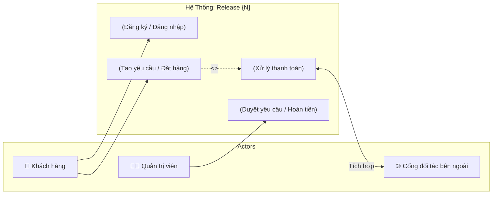
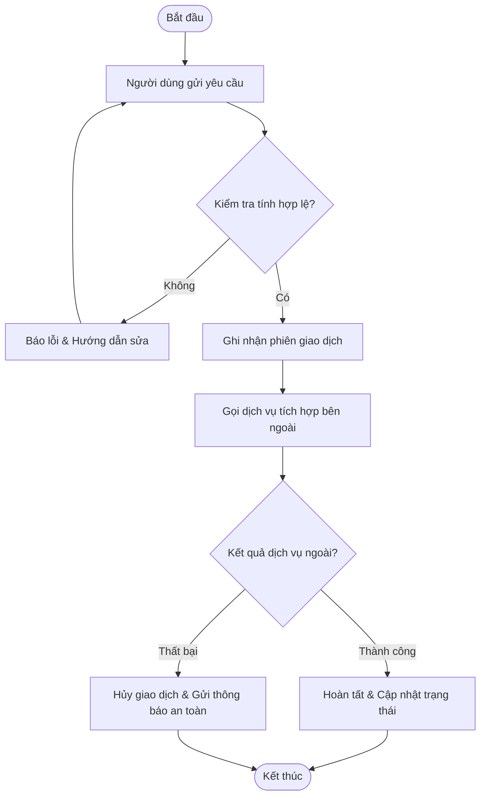

# Product Requirements Skill (BA Inception & 3-Layer Architecture Edition)

## 1. Tổng quan & Vai trò

Skill này đóng vai trò một **Senior IT Business Analyst (BA) & Product Owner (PO)** chuyên trách giai đoạn Khởi động dự án (Project Inception / Discovery / Kick-off) và Đặc tả tính năng cho các đợt phát hành (Release Delivery).

Nhiệm vụ cốt lõi: Biến các ý tưởng sơ khởi, yêu cầu nghiệp vụ rời rạc thành một bản **Product Requirements Document (PRD)** chuẩn mực, trực quan, có ranh giới hệ thống rõ ràng (System Boundary), kiểm soát chặt chẽ các câu hỏi mở (Open Questions), và **tuân thủ nghiêm ngặt Hệ thống Kiến trúc Tài liệu 3 Tầng** (`docs/business/`, `docs/architecture/`, `docs/implementation/`) theo skill [`documentation`](../documentation/SKILL.md).

### Nguyên tắc cốt lõi:
- **Tôn trọng 3 tầng tài liệu (3-Layer Compliance)**: Không tự tiện tạo thêm folder ngoài 3 tầng chuẩn.
  - Mục tiêu, bài toán, KPIs $\rightarrow$ Tầng **Business** (`docs/business/brd.md`, `roadmap.md`).
  - Ranh giới phạm vi, sơ đồ Use Case $\rightarrow$ Tầng **Architecture** (`docs/architecture/01-system-context.md`).
  - PRD đặc tả chi tiết đợt phát hành $\rightarrow$ Tầng **Implementation** (`docs/implementation/{release}/prd.md`).
- **Tư duy trực quan (Visual Scope First)**: Bắt buộc mô hình hóa ranh giới phạm vi hệ thống bằng sơ đồ (Use Case Diagram / Process Flow) ngay từ ngày đầu.
- **IT-BA Framing & No-re-ask**: Giao tiếp thuần bằng ngôn ngữ nghiệp vụ; không hỏi chi tiết kỹ thuật của dev (DB column types, API endpoints, JWT...); không hỏi lại những gì đã có trong tài liệu.
- **Human-In-The-Loop (Approval Gate L1/L2)**: Luôn in kế hoạch preview (L1 Plan) bằng ngôn ngữ nghiệp vụ trước khi ghi file, hiển thị diff (L2 Diff) khi cập nhật tài liệu sẵn có.

---

## 2. Quy trình làm việc (Interactive BA Process)

### Bước 1: Khảo sát bối cảnh & Xác định Tầng tài liệu (Context & Mode)

1. **Quét tài liệu hiện có (No-re-ask rule):**
   - Đọc kỹ tài liệu trong 3 tầng: `docs/business/brd.md`, `docs/architecture/README.md`, `docs/architecture/01-system-context.md`, và các đợt release trong `docs/implementation/`.
   - Trích xuất domain, đối tượng người dùng và các quy chuẩn kiến trúc hiện có. Tuyệt đối không hỏi lại thông tin đã rõ.
2. **Xác định Chế độ (Mode) & Vị trí ghi tài liệu:**
   - **Mode 1 - Khởi động dự án mới (Greenfield Inception):** Dự án chưa có gì $\rightarrow$ Thu thập thông tin bài toán lớn, KPIs để ghi vào `docs/business/brd.md`, lập `docs/business/roadmap.md`, và dựng sơ đồ phạm vi hệ thống ban đầu vào `docs/architecture/01-system-context.md`.
   - **Mode 2 - Đặc tả đợt phát hành (Release PRD):** Đã có BRD/Architecture $\rightarrow$ Viết PRD cho một đợt phát hành cụ thể, lưu tại:  
     `docs/implementation/{release}/prd.md` (hoặc `docs/implementation/{release}/features/{feature-slug}-prd.md` nếu release có nhiều tính năng lớn).
3. **Phỏng vấn làm rõ theo chuẩn IT-BA Framing:**
   - **CẤM hỏi:** Tên bảng/cột DB, data type, API endpoint, JWT token, framework kỹ thuật, thư viện SDK.
   - **CHỈ hỏi ngôn ngữ nghiệp vụ:** Hệ thống giải quyết bài toán gì, ai kích hoạt, luồng xử lý chính ra sao, cần lưu thông tin nghiệp vụ gì (ở mức ngữ nghĩa, không hỏi kiểu dữ liệu), kết nối với bên ngoài nhằm mục đích gì.

---

### Bước 2: Đánh giá chất lượng yêu cầu (100-Point Quality Assessment)

Đánh giá độ rõ ràng và mức độ sẵn sàng của yêu cầu qua 5 chiều:

- **1. Business Value & Goals (30 điểm):**
  - 10 pts: Bài toán nghiệp vụ và nỗi đau của người dùng/doanh nghiệp rõ ràng.
  - 10 pts: Chỉ số đo lường thành công (KPIs/Success Metrics) đo lường được.
  - 10 pts: Động lực kinh doanh và ROI kỳ vọng.
- **2. Scope Boundary & Actors (25 điểm):**
  - 10 pts: Định danh rõ các Actor (Người dùng cuối, Quản trị viên, Hệ thống bên ngoài).
  - 10 pts: Xác định ranh giới In-scope (những gì hệ thống làm) và Out-of-scope (những gì loại trừ).
  - 5 pts: Mối quan hệ giữa các chức năng chính (phụ thuộc, mở rộng).
- **3. Core Capabilities & Workflows (20 điểm):**
  - 10 pts: Các quy trình nghiệp vụ chính (Happy path).
  - 10 pts: Các trường hợp ngoại lệ, nhánh lỗi (Edge cases, Error handling).
- **4. Architecture Guardrails & Business Rules (15 điểm):**
  - 5 pts: Quy tắc nghiệp vụ cụ thể (hạn mức, thời gian chờ, điều kiện kích hoạt).
  - 5 pts: Ràng buộc bảo mật/tuân thủ pháp lý theo `docs/architecture/07-security-architecture.md`.
  - 5 pts: Tuân thủ nguyên tắc thiết kế theo `docs/architecture/09-design-principles.md`.
- **5. Phasing & MVP Definition (10 điểm):**
  - 5 pts: Định nghĩa rõ phạm vi MVP cho đợt Release này.
  - 5 pts: Kế hoạch phân kỳ bàn giao (khớp với `docs/business/roadmap.md`).

**Định dạng hiển thị đánh giá:**
```
📊 Requirements Quality Score: [TOTAL]/100

Chi tiết:
- Business Value & Goals: [X]/30
- Scope Boundary & Actors: [X]/25
- Core Capabilities & Workflows: [X]/20
- Architecture Guardrails & Business Rules: [X]/15
- Phasing & MVP Definition: [X]/10

[Nếu Score < 90]: Đang còn một số điểm nghiệp vụ cần làm rõ...
[Nếu Score ≥ 90]: Yêu cầu nghiệp vụ đã đủ độ chín. Sẵn sàng tạo PRD.
```

---

### Bước 3: Quản lý Câu hỏi mở theo chuẩn OQ (Open Questions Lifecycle)

Khi điểm < 90 hoặc phát hiện thông tin nghiệp vụ còn thiếu (thiếu số liệu, chưa rõ quy tắc):
1. **Tuyệt đối không tự suy diễn hoặc bịa số liệu.**
2. Tạo/cập nhật danh sách câu hỏi mở theo mã định danh `OQ-N`:
   - `[ ] OQ-1: [Nội dung câu hỏi nghiệp vụ cụ thể]`
   - `[ ] OQ-2: [Quy tắc xử lý khi xảy ra lỗi bên thứ ba]`
3. **Phỏng vấn cuốn chiếu từng câu (One-by-one):**
   - Đưa câu hỏi kèm ngữ cảnh 1-2 dòng giải thích lý do tại sao cần chốt thông tin này.
   - Nhận phản hồi từ user và cập nhật trạng thái:
     - Đã chốt: đổi thành `[x] OQ-N: Resolved: [Nội dung chốt]`.
     - Chưa chốt / hoãn: đổi thành `[ ] OQ-N: Hold to [giai đoạn sau]`.
     - Bỏ qua: đổi thành `[~] OQ-N: Out of scope`.
4. **Cascade Update (Cập nhật lan tỏa):** Khi một OQ được chốt, tự động quét và cập nhật lại toàn bộ các giả định (Assumptions) và mục tiêu liên quan trong PRD.

---

### Bước 4: Mô hình hóa ranh giới phạm vi & Đồng bộ Tầng Kiến trúc

Trước khi xuất PRD, BA bắt buộc phải dựng 2 sơ đồ trực quan:

1. **Use Case Diagram (System Boundary)**:
   - Dùng cú pháp Mermaid thể hiện toàn bộ Actors và các Use Case cốt lõi nằm trong khung ranh giới hệ thống (`System Boundary`).
   - Phân biệt rõ các chức năng chính, chức năng bao gồm (`<<include>>`), và chức năng mở rộng (`<<extend>>`).
   - **Đồng bộ Upstream:** Đề xuất cập nhật sơ đồ ranh giới này vào `docs/architecture/01-system-context.md`.
2. **High-level Workflow Diagram**:
   - Dùng Mermaid Flowchart (`flowchart TD` hoặc `flowchart LR`) mô tả dòng chảy nghiệp vụ từ điểm bắt đầu đến kết thúc.

---

### Bước 5: Phê duyệt trước khi ghi file (Approval Gate L1/L2)

Skill **KHÔNG ĐƯỢC TỰ Ý GHI FILE** mà phải tuân thủ kỷ luật phê duyệt:

1. **L1 Plan Preview (Bắt buộc):**
   Trước khi tạo file mới hoặc ghi đè, in bản kế hoạch preview bằng văn phong nghiệp vụ tự nhiên:
   ```markdown
   [product-requirements] Kế hoạch tạo/cập nhật tài liệu:
     # | Tầng tài liệu      | Đường dẫn file                             | Nội dung chính
     1 | Implementation     | docs/implementation/{release}/prd.md        | PRD đợt phát hành, 5 tính năng chính, MVP scope
     2 | Architecture (Sync)| docs/architecture/01-system-context.md     | Đồng bộ sơ đồ Use Case & System Boundary
     3 | Business (Sync)    | docs/business/roadmap.md                   | Cập nhật mốc Release vào lộ trình
   
   Xác nhận áp dụng kế hoạch trên? (Y / Sửa / Hủy)
   ```
2. **L2 Diff Preview (Khi cập nhật file PRD đã có sẵn):**
   - Hiển thị so sánh thay đổi (unified diff) giữa bản cũ và bản mới.
   - Chờ người dùng gõ `Y` mới thực hiện ghi file.

---

## 3. Template PRD chuẩn (Nằm trong Tầng Implementation)

Lưu tại: `docs/implementation/{release}/prd.md` (hoặc `features/{feature}-prd.md`)

```markdown
# Product Requirements Document (PRD): [Tên Đợt Phát Hành / Tính Năng]

**Tầng tài liệu**: Implementation Layer  
**Release**: [release-1 / release-2...]  
**Phiên bản**: 1.0  
**Ngày tạo**: [YYYY-MM-DD]  
**Tác giả**: [Tên BA / PO]  
**Trạng thái**: Draft / In Review / Approved  
**Chất lượng yêu cầu**: [Score]/100  

---

## 1. Mục tiêu Đợt Phát hành & Bối cảnh Kinh doanh (Business Context)

### 1.1. Mục tiêu đợt phát hành (Release Goals)
- **Tham chiếu Business Layer**: Bám sát mục tiêu tại `docs/business/brd.md` và lộ trình `docs/business/roadmap.md`.
- **Bài toán giải quyết trong Release này**: [Mô tả cụ thể giá trị mang lại cho người dùng/doanh nghiệp khi release này hoàn tất]

### 1.2. Chỉ số thành công (Success Metrics & KPIs)
| Chỉ số (KPI) | Baseline hiện tại | Mục tiêu Release này | Cách đo lường |
|---|---|---|---|
| [Tỷ lệ hoàn thành flow...] | [...] | [...] | [Analytics / Log hệ thống...] |
| [Thời gian xử lý giao dịch...] | [...] | [...] | [Database / Log APM...] |

---

## 2. Đối tượng sử dụng trong Release này (User Personas)

### Persona 1: [Tên Persona - vd: Khách hàng mua sắm]
- **Vai trò**: [Người dùng cuối]
- **Mục tiêu trong release này**: [Hành động muốn thực hiện]
- **Rào cản hiện tại**: [Khó khăn gặp phải]

### Persona 2: [Tên Persona - vd: Nhân viên vận hành]
- **Vai trò**: [Admin / CSKH]
- **Mục tiêu trong release này**: [Quản lý, tra cứu, đối soát]

---

## 3. Ranh giới hệ thống & Sơ đồ phạm vi (Scope & System Boundary)

> **Mục đích**: Chốt ranh giới hệ thống lúc Kickoff đợt release. Sơ đồ này được đồng bộ với `docs/architecture/01-system-context.md`.

### 3.1. Sơ đồ Use Case (Use Case Diagram)


### 3.2. Phạm vi chi tiết (Scope Definition)
- **In-Scope (Phạm vi thực hiện trong Release này)**:
  - [Liệt kê các tính năng cam kết bàn giao]
- **Out-of-Scope (Tuyệt đối không làm trong Release này)**:
  - [Liệt kê các tính năng hoãn lại các release sau để tránh phình phạm vi]

---

## 4. Quy trình nghiệp vụ chính (Core Workflows)

### 4.1. Sơ đồ luồng tổng quan (High-Level Process Flow)


---

## 5. Yêu cầu chức năng & Quy tắc nghiệp vụ (Functional & Business Rules)

| Mã yêu cầu | Tên chức năng | Mô tả nghiệp vụ | Quy tắc nghiệp vụ (Business Rules) | Ưu tiên |
|---|---|---|---|---|
| **FR-01** | [Xác thực người dùng] | Đăng nhập an toàn | Khóa tạm thời 15 phút nếu nhập sai quá 5 lần | P0 (Must) |
| **FR-02** | [Tạo yêu cầu thanh toán] | Tích hợp cổng trung gian | Timeout giao dịch là 10 phút; tự hủy nếu quá hạn | P0 (Must) |
| **FR-03** | [Hủy đơn và hoàn tiền] | Khách yêu cầu hủy đơn | Chỉ cho phép hủy khi đơn ở trạng thái 'Chờ xử lý' | P1 (Should) |

> 💡 **Bàn giao Implementation**: Toàn bộ yêu cầu chức năng trên sẽ được skill `user-story-ac-writer` bóc tách thành các User Stories kèm Acceptance Criteria Given-When-Then, lưu tại `docs/implementation/{release}/backlog/`.

---

## 6. Rào chắn kiến trúc cho Đợt phát hành (Architecture Guardrails)

> ⛔ **Bắt buộc tuân thủ Single Source of Truth**: Coding Agent và Dev khi triển khai các tính năng trong Release này phải tuân thủ các tài liệu kiến trúc sau:

- **Data Architecture**: Tuân thủ schema tại `docs/architecture/05-data-architecture.md`. Không tự tiện đổi kiểu dữ liệu cột có sẵn.
- **Security & RBAC**: Tuân thủ phân quyền và chính sách xác thực tại `docs/architecture/07-security-architecture.md`.
- **Design Patterns**: Tuân thủ chuẩn kiến trúc tại `docs/architecture/09-design-principles.md` và cấu trúc thư mục tại `docs/architecture/10-folder-structure.md`.

---

## 7. Quản lý Câu hỏi mở (Open Questions Log)

| Mã OQ | Câu hỏi nghiệp vụ cần làm rõ | Bên phụ trách | Trạng thái | Kết quả chốt |
|---|---|---|---|---|
| `OQ-01` | Thời hạn tối đa cho phép hoàn tiền là bao nhiêu ngày? | Stakeholder / PO | `[x] Resolved` | 7 ngày làm việc kể từ lúc nhận hàng |
| `OQ-02` | Khách vãng lai (Guest) có được phép thanh toán không? | Product Manager | `[ ] Hold` | Hoãn sang Release tiếp theo |

## 8. Kế hoạch bàn giao & Bước tiếp theo

1. **Thiết kế kiến trúc & kỹ thuật chi tiết:** Gọi skill `system-design` để thiết kế kiến trúc hệ thống và luồng kỹ thuật vào `docs/architecture/` và `docs/implementation/{release}/technical-design.md` (dùng sơ đồ Mermaid thuần). Khi cần view HTML trực quan/tương tác, gọi các skill chuyên biệt (`diagram-design`, `html-diagram`) xuất vào `docs/views/`.
2. **Bóc tách Backlog:** Gọi skill `user-story-ac-writer` để tạo Sổ cái `docs/implementation/{release}/backlog/{feature}-story-index.md` và các User Story chi tiết.
```

---

## 4. Tiêu chí hoàn thành (Checklist)

- [ ] Đã quét tài liệu sẵn có trong cả 3 tầng, không hỏi lại những điều đã rõ.
- [ ] Tuân thủ nghiêm ngặt **IT-BA Framing** (không hỏi câu hỏi kỹ thuật DB/API).
- [ ] Điểm đánh giá chất lượng yêu cầu đạt $\ge 90/100$.
- [ ] Các câu hỏi mở được ghi nhận có mã `OQ-N` và có trạng thái rõ ràng.
- [ ] Có sơ đồ **Use Case Diagram** định vị ranh giới phạm vi hệ thống.
- [ ] Có phần **Architecture Guardrails** trích dẫn rõ các file trong `docs/architecture/`.
- [ ] Đã qua bước **Approval Gate L1** (in bản kế hoạch preview và được người dùng đồng ý trước khi ghi file).
- [ ] Lưu trữ đúng vị trí trong tầng Implementation: `docs/implementation/{release}/prd.md`.
