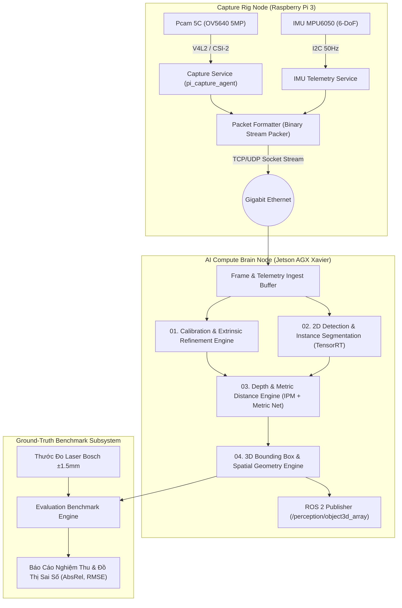

# 02 - High-Level Architecture Topology

> **Layer:** Architecture Layer (`docs/architecture/02-high-level-architecture.md`)  
> **Status:** Single Source of Truth — Living Architecture  

---

## 1. System Topology Overview

Hệ thống được chia thành 3 phân vùng vật lý độc lập:
1. **Edge Capture Node (Raspberry Pi 3):** Đóng gói phần cứng thu nhận ảnh thời gian thực, đọc cảm biến IMU, đồng bộ hóa header và đóng gói luồng dữ liệu truyền qua mạng.
2. **Compute Brain Node (Jetson AGX Xavier):** Thực hiện giải nén frame, đồng bộ buffer, suy luận học sâu (YOLOv8-seg, Metric Depth Net), tính toán hình học Inverse Perspective Mapping (IPM) và sinh 3D Bounding Box.
3. **Evaluation & Ground-Truth Benchmark Node:** Nhận kết quả ước lượng từ Jetson AGX và dữ liệu đo trực tiếp từ thước laser để tính toán sai số thống kê phục vụ kiểm chứng khoa học.

---

## 2. Fundamental Architectural Invariants

- **Decoupled Capture & Processing:** Không thực hiện bất kỳ mô hình Deep Learning nặng nào trên Raspberry Pi 3. Toàn bộ năng lực tính toán AI được dồn về GPU Tensor Core của Jetson AGX Xavier.
- **Hardware Coordinate Conventions:**
  - *Camera Optical Frame:* Trục $+Z$ hướng thẳng ra phía trước theo trục quang học; trục $+X$ hướng sang phải; trục $+Y$ hướng thẳng xuống dưới.
  - *Robot Body Frame (`base_footprint`):* Trục $+X$ hướng về phía trước robot; trục $+Y$ hướng sang trái; trục $+Z$ hướng thẳng đứng lên trên.
  - Mọi phép biến đổi giữa hai hệ tọa độ phải thông qua ma trận biến đổi thuần nhất $T_{\text{robot}}^{\text{cam}}$ cố định.
- **Zero Raw Data Modification:** Ảnh thô và dữ liệu cảm biến đo đạc không được làm mịn giả tạo trước khi qua bộ ước lượng nhằm đảm bảo tính trung thực của kết quả nghiên cứu.
