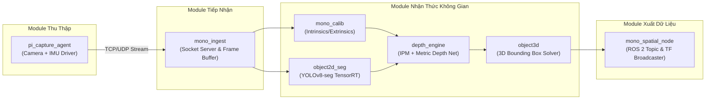

# 03 - Service & Module Architecture

> **Layer:** Architecture Layer (`docs/architecture/03-service-architecture.md`)  
> **Status:** Single Source of Truth — Living Architecture  

---

## 1. Modular Decomposition

Hệ thống mã nguồn được phân rã thành các module chức năng độc lập có ranh giới trách nhiệm (bounded context) rõ ràng:

---

## 2. Component Specifications

### 2.1. `pi_capture_agent`
- **Môi trường:** Chạy trên Raspberry Pi 3 (Raspberry Pi OS Bullseye/Bookworm).
- **Trách nhiệm:**
  - Giao tiếp với cảm biến OV5640 qua V4L2 hoặc libcamera.
  - Đọc thanh ghi cảm biến MPU6050 qua I2C bus `/dev/i2c-1` để lấy gia tốc 3 trục $[a_x, a_y, a_z]$.
  - Đóng gói Frame Header nhị phân: `Timestamp (int64 ns)`, `Pitch (float32)`, `Roll (float32)`, `Payload Length (uint32)`.
  - Truyền dữ liệu sang Jetson AGX Xavier với độ trễ thấp nhất.

### 2.2. `mono_ingest`
- **Môi trường:** Chạy trên Jetson AGX Xavier.
- **Trách nhiệm:**
  - Khởi tạo socket server tiếp nhận luồng dữ liệu từ Pi 3.
  - Quản lý hàng đợi đệm (Ring Buffer) tránh tràn bộ nhớ khi GPU đang suy luận.
  - Đồng bộ khung hình và góc nghiêng theo tem thời gian.

### 2.3. `mono_calib`
- **Trách nhiệm:**
  - Nạp thông số nội suy camera $K$ từ tệp cấu hình YAML.
  - Cập nhật ma trận quay $R(\theta, \phi)$ động dựa trên góc pitch/roll thời gian thực từ IMU.
  - Cung cấp hàm biến đổi nghịch đảo điểm ảnh xuống mặt phẳng thế giới.

### 2.4. `depth_engine`
- **Trách nhiệm:**
  - *Engine IPM:* Tính cự ly tiếp xúc sàn $Z = \frac{h_c}{\tan(\theta + \alpha_v)}$.
  - *Engine Metric Depth Net:* Chạy mô hình Depth Anything V2 Metric (TensorRT FP16) đối với các pixel không thuộc sàn.
  - Hợp nhất độ sâu tạo bản đồ cự ly tin cậy cho từng đối tượng.

### 2.5. `object3d`
- **Trách nhiệm:**
  - Tiếp nhận mặt nạ phân đoạn 2D (Instance Mask) và hộp bao 2D từ YOLOv8-seg.
  - Trích xuất điểm tiếp xúc mặt đất thấp nhất (Lowest Ground Contact Point).
  - Khôi phục tọa độ 3D $[X, Y, Z]$ trong hệ tọa độ camera và chuyển vị sang hệ quy chiếu robot.
  - Ước lượng kích thước hình học thực $[L, W, H]$ và tạo hộp bao 3D Bounding Box.
