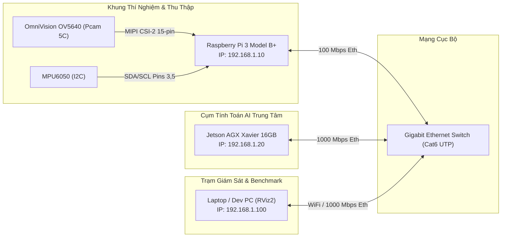

# 04 - Deployment & Infrastructure Architecture

> **Layer:** Architecture Layer (`docs/architecture/04-deployment-architecture.md`)  
> **Status:** Single Source of Truth — Living Architecture  

---

## 1. Physical & Network Topology

---

## 2. Node Computing Environments & Runtime Stacks

### 2.1. Node 1: Raspberry Pi 3 Model B/B+
- **Hệ điều hành:** Raspberry Pi OS Lite (64-bit hoặc 32-bit tối ưu kernel V4L2).
- **Driver:** Cấu hình Device Tree Overlay cho cảm biến OV5640 (`dtoverlay=ov5640` hoặc V4L2 subdevice driver).
- **Thư viện phụ trợ:** `smbus2` (giao tiếp MPU6050 qua I2C), `opencv-python-headless` (hoặc `libcamera-apps`).
- **Dịch vụ hệ thống:** `pi-capture.service` (Systemd daemon tự khởi chạy khi bật nguồn).

### 2.2. Node 2: NVIDIA Jetson AGX Xavier 16GB
- **Carrier Board:** Auvidea X221-AI hoặc DevKit chuẩn.
- **Hệ điều hành:** Ubuntu 20.04 LTS (JetPack 5.1.x / L4T 35.x) hoặc Ubuntu 22.04 LTS (JetPack 6.x).
- **Tăng tốc phần cứng:**
  - CUDA 11.4 / 12.x
  - cuDNN 8.6+
  - TensorRT 8.5+
- **Môi trường cách ly:** Bắt buộc sử dụng Python Virtualenv cục bộ (`.venv`) hoặc Docker container có GPU runtime (`nvidia-container-toolkit`).
- **ROS 2:** ROS 2 Foxy Fitzroy (Ubuntu 20.04) hoặc Humble Hawksbill (Ubuntu 22.04) với FastDDS rmw.

---

## 3. Communication Latency Budget & Bandwidth

| Phân đoạn truyền dẫn | Giao thức | Băng thông dự kiến | Độ trễ mục tiêu |
| :--- | :--- | :--- | :--- |
| Pcam 5C $\rightarrow$ Pi 3 Memory | MIPI CSI-2 2-lane | $\approx 1.0\text{ Gbps}$ | $< 5\text{ms}$ |
| Pi 3 $\rightarrow$ Jetson AGX (Frame stream) | TCP / UDP Socket (MJPEG/H.264) | $15 - 35\text{ Mbps}$ | $< 15\text{ms}$ |
| Ingest Buffer $\rightarrow$ TensorRT Inference | GPU Unified Memory / pinned memory | N/A | $25 - 35\text{ms}$ |
| Object3D Engine $\rightarrow$ ROS 2 DDS Topic | FastDDS Shared Memory (Intra-process) | N/A | $< 2\text{ms}$ |
| **Tổng độ trễ từ cảm biến tới 3D Bounding Box** | **End-to-End Pipeline** | N/A | $\le 60\text{ms}$ ($\ge 16.6\text{ FPS}$) |
