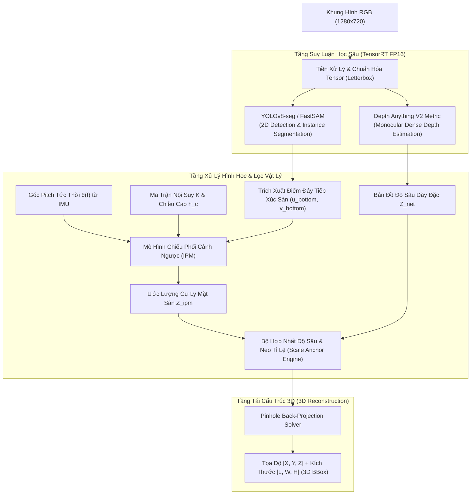

# 06 - AI Pipeline & Perception Architecture

> **Layer:** Architecture Layer (`docs/architecture/06-ai-architecture.md`)  
> **Status:** Single Source of Truth — Living Architecture  

---

## 1. Deep Learning & Mathematical Pipeline

Pipeline AI kết hợp chặt chẽ giữa học sâu dựa trên trọng số tiền huấn luyện (Pretrained Deep Learning) và các quy luật hình học quang học xạ ảnh (Projective Geometry):

---

## 2. Mathematical Formulations

### 2.1. Inverse Perspective Mapping (IPM) Formula
Với camera đặt ở độ cao $h_c$, góc chúc pitch $\theta$, góc nhìn dọc theo pixel $v$:
$$\alpha_v = \arctan \left( \frac{v - c_y}{f_y} \right)$$
Khoảng cách theo phương dọc trục quang học $Z_{\text{ground}}$ tới điểm tiếp xúc mặt đất:
$$Z_{\text{ground}} = \frac{h_c}{\tan(\theta(t) + \alpha_v)}$$
Tọa độ ngang $X_{\text{ground}}$:
$$X_{\text{ground}} = Z_{\text{ground}} \cdot \frac{u - c_x}{f_x}$$

### 2.2. Dynamic Tilt Compensation via IMU MPU6050
Góc $\theta(t)$ được cập nhật liên tục từ gia tốc trọng trường:
$$\theta(t) = \theta_{\text{nominal}} + \Delta \theta_{\text{IMU}}(t) = \theta_{\text{nominal}} + \arctan2\left(a_z, \sqrt{a_x^2 + a_y^2}\right)$$
Nhờ đó, rung chấn cơ học hoặc độ biến dạng khung gầm được triệt tiêu tức thời.

### 2.3. Scale-Anchored Metric Depth Fusion
Đối với các phần thân trên của vật thể hoặc vật cản lơ lửng, tỷ lệ co giãn (Scale Factor $s$) được tính bằng cách so khớp vùng chân tiếp xúc sàn giữa $Z_{\text{ground}}$ và giá trị độ sâu của mạng:
$$s = \frac{Z_{\text{ground}}}{\text{median}(Z_{\text{net}}[\text{mask}_{\text{contact}}])}$$
Bản đồ chiều sâu toàn bộ vật thể được neo theo tỷ lệ chuẩn:
$$Z_{\text{metric}}(u, v) = s \cdot Z_{\text{net}}(u, v)$$

---

## 3. Model Zoo & Hardware Acceleration Table

| Module | Model Architecture | Input Resolution | Precision | TensorRT Optimization | Latency Budget |
| :--- | :--- | :--- | :--- | :--- | :--- |
| **Detection & Seg** | YOLOv8s-seg / YOLOv8n-seg | $640 \times 640$ | FP16 | Explicit batch 1, TensorRT 8.5+ | $\le 15\text{ms}$ |
| **Metric Depth** | Depth Anything V2 Metric (Small) | $518 \times 518$ | FP16 | Static shape engine | $\le 22\text{ms}$ |
| **Geometry & 3D Box** | NumPy / Cython IPM Solver | Vectorized points | FP32 | CPU vectorized (ARM Neon) | $\le 3\text{ms}$ |
