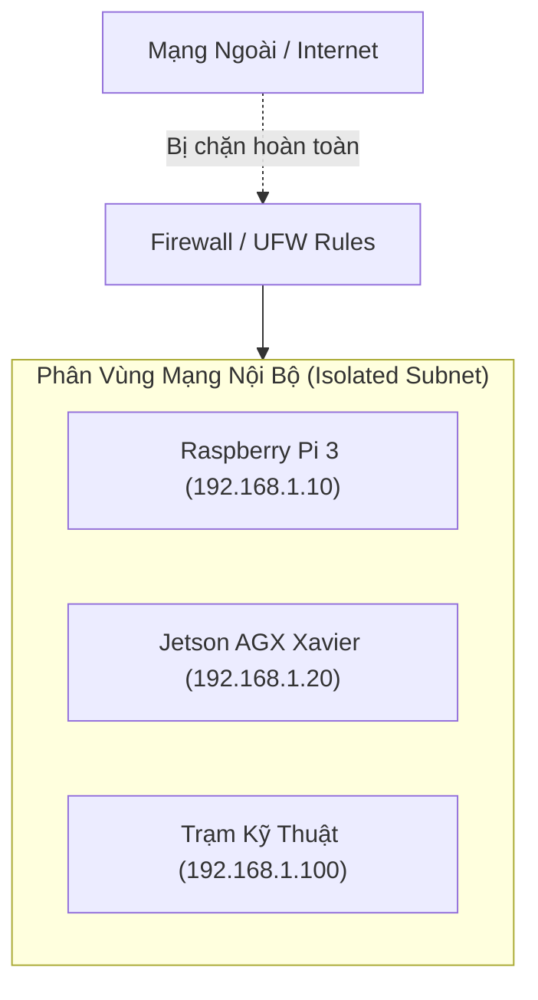

# 07 - Security Architecture & Access Control

> **Layer:** Architecture Layer (`docs/architecture/07-security-architecture.md`)  
> **Status:** Single Source of Truth — Living Architecture  

---

## 1. Network Boundary & Device Isolation

Hệ thống hoạt động trong mạng cục bộ nội bộ (LAN Subnet: `192.168.1.0/24`) không công khai ra Internet công cộng:

---

## 2. Access Control Policies

1. **SSH Authentication Invariant:**
   - Vô hiệu hóa xác thực mật khẩu thông thường (`PasswordAuthentication no`).
   - Bắt buộc xác thực bằng Ed25519 SSH Public Key giữa trạm làm việc và các board nhúng (Pi 3, Jetson AGX).
2. **Camera Hardware Device Permissions:**
   - Chỉ tài khoản thuộc nhóm `video` và `i2c` mới có quyền truy cập trực tiếp các node thiết bị `/dev/video*` và `/dev/i2c-1`.
3. **DDS Domain Separation:**
   - Cấu hình biến môi trường `ROS_DOMAIN_ID=42` để cách ly luồng dữ liệu ROS 2 của robot khỏi các nhóm nghiên cứu khác cùng chia sẻ mạng phòng lab UIT.
4. **Data Logging & Privacy Invariant:**
   - Dữ liệu ảnh thực nghiệm chỉ được thu thập trong khu vực nghiên cứu của ASIC Lab.
   - Khi lưu trữ dữ liệu benchmark công khai, phải làm mờ thông tin cá nhân (khuôn mặt người tham gia thử nghiệm) nếu có yêu cầu bảo mật thông tin.
