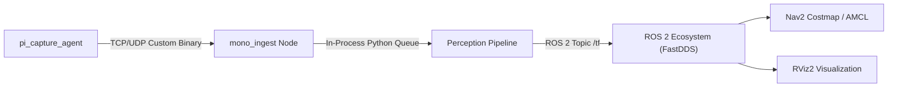

# 08 - Integration & Interface Architecture

> **Layer:** Architecture Layer (`docs/architecture/08-integration-architecture.md`)  
> **Status:** Single Source of Truth — Living Architecture  

---

## 1. External & Inter-Process Communication Interfaces

Hệ thống sử dụng hai cơ chế giao tiếp chính:
1. **Low-Latency Binary Socket:** Dùng để truyền luồng ảnh và telemetry thô từ Raspberry Pi 3 sang Jetson AGX Xavier.
2. **ROS 2 Middleware (FastDDS):** Dùng để phân phối kết quả nhận thức không gian (Depth, 3D Bounding Box, TF) cho các thành phần điều hướng Navigation 2.

---

## 2. ROS 2 Topic & Interface Catalog

| Topic Name | Message Type | Rate (Hz) | QoS Profile | Description |
| :--- | :--- | :--- | :--- | :--- |
| `/perception/mono/image_raw` | `sensor_msgs/msg/Image` | 30 | Best Effort / Volatile | Ảnh RGB thô đã được ingest từ Pcam 5C |
| `/perception/mono/camera_info` | `sensor_msgs/msg/CameraInfo` | 30 | Transient Local / Reliable | Ma trận thông số nội suy $K$ và distortion |
| `/perception/mono/depth_metric` | `sensor_msgs/msg/Image` (32FC1) | 15–20 | Best Effort / SensorData | Bản đồ độ sâu theo mét (Metric Depth Map) |
| `/perception/mono/objects_3d` | `vision_msgs/msg/Detection3DArray` | 15–20 | Reliable / Keep Last 10 | Danh sách hộp bao 3D (vị trí $XYZ$, kích thước $LWH$) |
| `/perception/mono/telemetry` | `geometry_msgs/msg/Vector3Stamped` | 50 | SensorData | Góc pitch, roll tức thời thu từ IMU MPU6050 |
| `/tf` | `tf2_msgs/msg/TFMessage` | Dynamic | Dynamic | Tọa độ biến đổi $T_{\text{base\_footprint}}^{\text{camera\_optical\_frame}}$ |

---

## 3. FastDDS Quality of Service (QoS) Rules

- **High-throughput Topics (`image_raw`, `depth_metric`):**
  - Reliability: `BEST_EFFORT`
  - History: `KEEP_LAST` với Depth = 1.
  - Mục đích: Không chặn luồng tính toán nếu consumer bị trễ nhịp (Drop frame cũ hơn là giữ nghẽn hàng đợi).
- **Critical Semantic Topics (`objects_3d`):**
  - Reliability: `RELIABLE`
  - History: `KEEP_LAST` với Depth = 10.
  - Mục đích: Đảm bảo Nav2 không bị rớt mất cảnh báo vật cản nguy hiểm phía trước.
