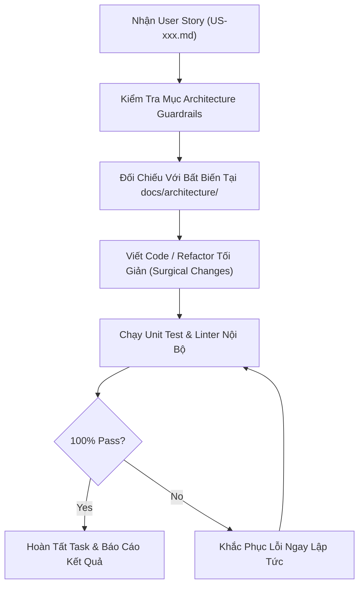

# 09 - Software Design Principles & Code Invariants

> **Layer:** Architecture Layer (`docs/architecture/09-design-principles.md`)  
> **Status:** Single Source of Truth — Living Architecture  

---

## 1. Core Engineering Principles

1. **Clean Code & Robert C. Martin Standards:**
   - Hàm ngắn gọn, chỉ làm một nhiệm vụ duy nhất (Single Responsibility Principle).
   - Tên biến, tên hàm thể hiện rõ nghĩa vật lý: dùng `ground_depth_m` thay vì `d`; dùng `pitch_rad` thay vì `p`.
   - Giữ mã nguồn luôn sạch hơn lúc tiếp nhận (Boy Scout Rule).
2. **Explicit Error Handling & Zero Silent Failures:**
   - Không được bắt lỗi bằng khối `except: pass` trống rỗng. Mọi lỗi phần cứng (mất tín hiệu camera, lỗi đọc I2C IMU, sai socket) phải được ghi log với cấp độ thích hợp (`ERROR`/`FATAL`) và phát cờ trạng thái hỏng (fail-safe status).
   - Khi không tìm thấy điểm tiếp xúc mặt đất hoặc vật thể vượt ra ngoài trường nhìn camera, hàm phải trả về kết quả `None` hoặc giá trị `NaN` được kiểm soát thay vì ném ngoại lệ làm sập toàn bộ tiến trình.
3. **Deterministic Mathematical Implementations:**
   - Mọi hàm biến đổi hình học (IPM, pinhole projection, Euler angle rotation) phải được viết theo dạng hàm thuần túy (Pure Functions) không phụ thuộc biến toàn cục (side-effect free) để thuận tiện cho việc viết Unit Test.
4. **Environment Isolation Discipline:**
   - Mọi script và dependency bắt buộc chạy trong môi trường ảo cục bộ (`.venv` qua `uv`).
   - Tuyệt đối không cài đặt thư viện vào Python toàn cục của hệ điều hành trên Jetson hay Pi.

---

## 2. Invariant Rules for AI Coding Agents

- **Surgical Changes:** Chỉ chỉnh sửa các dòng mã trực tiếp liên quan đến yêu cầu của User Story. Không tự tiện format lại code hoặc refactor các module xung quanh.
- **No Orphan Artifacts:** Mọi import không sử dụng, biến thừa hoặc file thử nghiệm tạm thời phải được dọn dẹp sạch sẽ trước khi kết thúc task.
