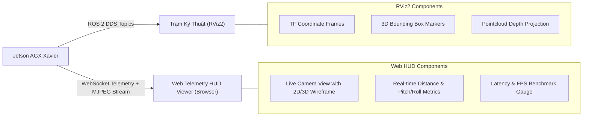

# 11 - Frontend & Operator Visualization System Design

> **Layer:** Architecture Layer (`docs/architecture/11-frontend-system-design.md`)  
> **Status:** Single Source of Truth — Living Architecture  

---

## 1. Operator Visualization Overview

Hệ thống cung cấp hai phương thức trực quan hóa dữ liệu nhận thức không gian 3D cho kỹ sư vận hành và nhà nghiên cứu:
1. **ROS 2 Standard RViz2 Visualization:** Sử dụng các Marker 3D và PointCloud2 hiển thị trực tiếp trong hệ quy chiếu robot.
2. **Web Telemetry & Diagnostic HUD Viewer:** Giao diện web nhẹ phục vụ theo dõi từ xa qua trình duyệt không cần cài đặt ROS 2 đầy đủ.

---

## 2. Display Viewports & Hierarchy

- **Primary Viewport (Front Optical View):** Khung hình ảnh camera gốc kích thước $1280 \times 720$ với lớp phủ (overlay):
  - Hộp bao 2D và mặt nạ phân đoạn màu bán trong suốt (alpha = 0.4).
  - Điểm tiếp xúc sàn màu đỏ rực rỡ với nhãn khoảng cách $Z_{\text{ipm}}$ (ví dụ: `Z: 1.82m`).
  - Hộp bao 3D dạng khung dây (3D wireframe box) chiếu ngược lên ảnh.
- **Secondary Viewport (Bird's Eye View - BEV Topdown):** Mặt phẳng tọa độ cực nhìn từ trên cao xuống:
  - Vị trí camera tại gốc tọa độ $(0, 0)$.
  - Tọa độ các vật thể được vẽ dưới dạng hình chữ nhật hoặc điểm tròn trên lưới ô vuông cách nhau $0.5\text{m}$.
- **Telemetry HUD Sidebar:**
  - Góc pitch tức thời: $\theta(t)$ (độ).
  - Góc roll tức thời: $\phi(t)$ (độ).
  - Tốc độ khung hình (FPS) và độ trễ suy luận AI biên (ms).
