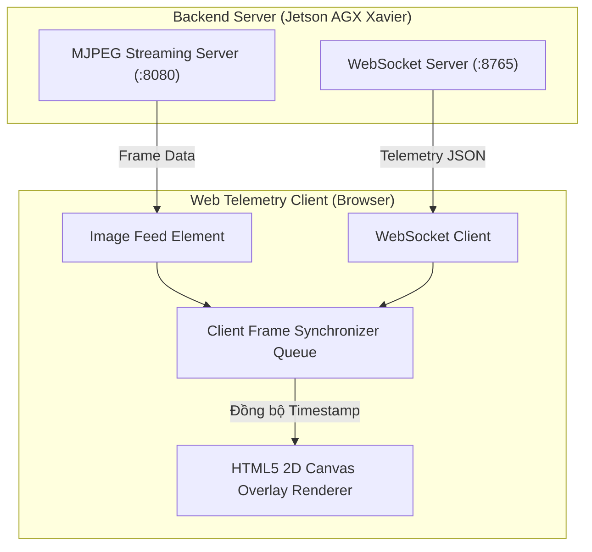

# 13 - Frontend & Telemetry Client Architecture

> **Layer:** Architecture Layer (`docs/architecture/13-frontend-architecture.md`)  
> **Status:** Single Source of Truth — Living Architecture  

---

## 1. Client State Management & Streaming Pipeline

Client trực quan hóa telemetry tiếp nhận đồng thời hai luồng dữ liệu từ Jetson AGX Xavier:
1. **Video Canvas Stream:** Luồng MJPEG qua HTTP hoặc WebRTC Datachannel với độ trễ dưới $50\text{ms}$.
2. **Metadata Stream:** Luồng JSON qua WebSocket (chứa danh sách tọa độ 3D Bounding Box, góc pitch/roll, và thống kê suy luận).

---

## 2. Invariant Synchronization Rules

- **Timestamp-Based Overlay Alignment:** Không render overlay hộp bao 3D lên khung hình nếu chênh lệch timestamp giữa hình ảnh và metadata vượt quá $50\text{ms}$.
- **Zero Heavy Computation on Client:** Client chỉ chịu trách nhiệm vẽ các vector đỉnh và hộp chữ nhật đã được tính toán sẵn từ Jetson AGX Xavier; không thực thi phép nhân ma trận hình học nặng nề trên trình duyệt.
- **Fail-Safe Disconnect State:** Khi mất kết nối WebSocket quá 2 giây, giao diện tự động chuyển sang chế độ cảnh báo "TELEMETRY DISCONNECTED" với viền đỏ để thông báo cho người vận hành.
