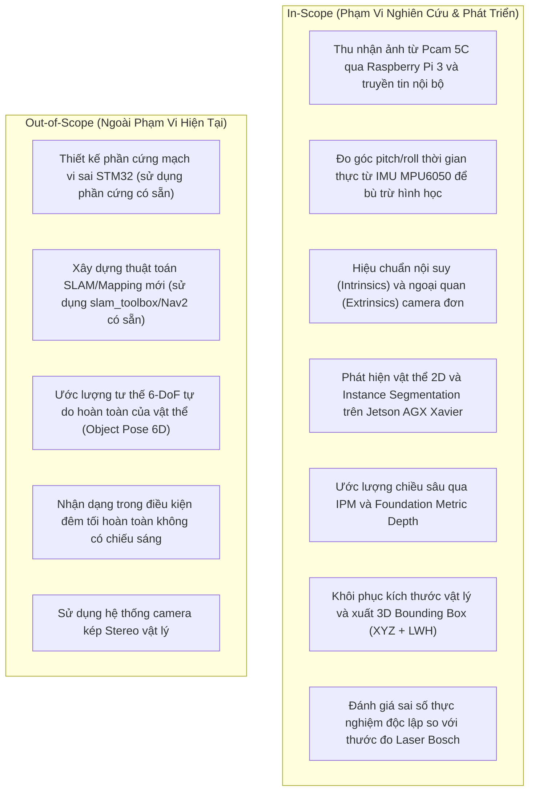

# Business Requirement Document (BRD) — Monocular Spatial Vision

> **Layer:** Business Layer (`docs/business/brd.md`)  
> **Project:** Monocular Spatial Vision (Nhận thức Không gian 3D Đơn kính cho Mobile Robot)  
> **Organization:** ASIC Lab, Faculty of Computer Engineering, UIT - VNUHCM  
> **Status:** Living Document  
> **Last Updated:** 2026-10-05  

---

## 1. Executive Summary & Problem Statement

### 1.1. Context & Business Need
Trong các hệ thống Mobile Robot tự hành công nghiệp và nghiên cứu, nhận thức không gian 3D (3D Spatial Perception) đóng vai trò sống còn trong việc lập kế hoạch đường đi, tránh vật cản động/tĩnh, và tương tác an toàn với môi trường xung quanh.

Hiện nay, các giải pháp cảm biến đo khoảng cách 3D truyền thống gặp phải các rào cản lớn:
- **LiDAR 3D đa tia:** Chi phí phần cứng cực kỳ đắt đỏ, tiêu thụ điện năng lớn, cồng kềnh, không phù hợp cho robot cỡ nhỏ và vừa.
- **LiDAR 2D đơn tia:** Giá thành vừa phải nhưng chỉ quét trên một mặt phẳng cắt duy nhất, tạo ra các "vùng mù" chết người (vật cản treo lơ lửng như mép bàn, vật cản dưới sàn thấp hơn tia quét, rào chắn mỏng).
- **Hệ thống Stereo Camera (2 camera vật lý):** Yêu cầu đồng bộ thời gian xung phần cứng cực ngặt ($\Delta t < 1\text{ms}$), nhạy cảm cao với biến dạng nhiệt/cơ khí làm lệch trục baseline quang học, chi phí tính toán disparity map dày đặc rất nặng nề.

### 1.2. The Solution: Monocular 3D Spatial Perception
Dự án **Monocular Spatial Vision** tập trung nghiên cứu và xây dựng giải pháp nhận thức không gian 3D chỉ sử dụng **một camera quang học đơn lẻ** (Digilent Pcam 5C / cảm biến OV5640) kết hợp cảm biến gia tốc/góc nghiêng phụ trợ (IMU MPU6050) và bộ tính toán AI biên (Jetson AGX Xavier).

Giải pháp này nhằm mục tiêu:
1. Nhận thức ngữ nghĩa vật thể 2D phía trước (chủng loại, bounding box, đường viền tiếp xúc sàn).
2. Ước lượng khoảng cách tuyệt đối (Metric Depth) và tọa độ 3D ($X, Y, Z$) của vật thể trong hệ quy chiếu robot.
3. Dự đoán kích thước vật lý thực (dài, rộng, cao) và xuất hộp bao 3D (3D Bounding Box) phục vụ trực tiếp cho thuật toán né tránh vật cản của Navigation Stack (Nav2/ROS 2).

---

## 2. Business Goals & Strategic Objectives

| ID | Strategic Objective | Business Impact |
| :--- | :--- | :--- |
| **OBJ-01** | Tối ưu hóa chi phí phần cứng nhận thức | Giảm chi phí cảm biến thị giác 3D từ mức hàng ngàn USD (LiDAR 3D/Stereo công nghiệp) xuống dưới 100 USD (cụm camera đơn Pcam 5C + IMU). |
| **OBJ-02** | Khử vùng mù mặt phẳng của 2D LiDAR | Phát hiện và đo đạc các vật cản nằm ngoài mặt phẳng quét laser 2D (chân bàn, vật cản thấp, vật cản treo) trước khi robot tiếp cận. |
| **OBJ-03** | Tính độc lập & module hóa cao | Xây dựng pipeline kiểm nghiệm độc lập (Standalone Sandbox) kiểm chứng giả thuyết toán học trước khi tích hợp vào cụm vi sai và slam_toolbox. |
| **OBJ-04** | Đảm bảo tính tái lập khoa học | Cung cấp chuẩn benchmark với độ đo Ground-Truth chuẩn mực bằng thước laser quang học, hỗ trợ công bố khoa học và chuyển giao công nghệ. |

---

## 3. Success Metrics & Key Performance Indicators (KPIs)

| Metric Code | KPI Description | Target Threshold | Measuring Method |
| :--- | :--- | :--- | :--- |
| **KPI-01** | Sai số khoảng cách tiếp xúc mặt sàn (IPM) trong phạm vi $0.5\text{m} - 3.0\text{m}$ | $\text{AbsRel} \le 5.0\%$ | So sánh với thước laser Bosch ($\pm 1.5\text{mm}$) trên lưới tọa độ phẳng |
| **KPI-02** | Sai số chiều sâu đối với vật cản không chạm sàn (Metric Depth Net) | $\text{AbsRel} \le 10.0\%$ | Đánh giá qua mô hình Depth Anything V2 Metric neo tỷ lệ |
| **KPI-03** | Độ trễ xử lý suy luận AI tại biên (Inference Latency) trên Jetson AGX Xavier | $\le 40\text{ms}$/frame ($\ge 25\text{ FPS}$) | TensorRT engine benchmark FP16 |
| **KPI-04** | Độ chính xác nhận dạng vật thể 2D & phân đoạn thực thể | $\text{mAP}_{50-95} \ge 65\%$ | Tập dữ liệu validation thực tế tại lab |
| **KPI-05** | Tỷ lệ suy giảm do trôi góc nghiêng (với bù trừ IMU động) | Giảm phương sai sai số $\sigma^2_Z \ge 40\%$ | Thử nghiệm có rung lắc/nghiêng động giả lập |

---

## 4. Scope Boundaries

---

## 5. Ubiquitous Operating Constraints

- **Môi trường hoạt động:** Robot di chuyển trong nhà (indoor), bề mặt sàn tương đối bằng phẳng (sai số độ mấp mô $\le 2\text{cm}$).
- **Điều kiện ánh sáng:** Chiếu sáng văn phòng tiêu chuẩn ($200 - 800\text{ lux}$).
- **Cơ sở hạ tầng:** Mạng Gigabit Ethernet kết nối giữa bộ thu nhận (Pi 3) và bộ não AI (Jetson AGX Xavier).
- **Phân tách trách nhiệm:** Tầng Nghiên cứu Độc lập (Standalone Sandbox) kiểm chứng thuật toán toán học trước, tách biệt hoàn toàn với trôi dạt odometry bánh xe cơ khí.
