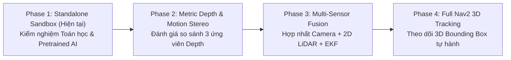

# Product & Research Roadmap — Monocular Spatial Vision

> **Layer:** Business Layer (`docs/business/roadmap.md`)  
> **Project:** Monocular Spatial Vision  
> **Horizon Planning:** Phased Milestones (Phase 1 to Phase 4)  
> **Status:** Active Roadmap  

---

## 1. Overview of Release Horizons

Lộ trình phát triển được thiết kế theo nguyên tắc phân tách rủi ro (Risk De-coupling): kiểm chứng độc lập tính đúng đắn của thị giác đơn mắt trong môi trường có kiểm soát (Sandbox) trước khi tích hợp vào chuyển động của Mobile Robot.

---

## 2. Detailed Milestone Capabilities

### Phase 1: Standalone Research Sandbox (Release 1) — *Current Focus*
- **Mục tiêu:** Kiểm nghiệm 4 giả thuyết khoa học ($H_1 - H_4$) trên giá đỡ cơ khí tĩnh cứng vững (rigid test rig).
- **Trọng tâm năng lực:**
  - Thu nhận ảnh Pcam 5C ổn định qua Raspberry Pi 3, stream dữ liệu qua mạng Ethernet.
  - Đọc và bù trừ vector trọng lực / góc nghiêng tức thời từ IMU MPU6050.
  - Hiệu chuẩn nội suy thấu kính và ngoại quan mặt sàn chính xác.
  - Phân đoạn tiếp xúc sàn (Instance Segmentation) + ước lượng khoảng cách mặt phẳng (IPM).
  - So sánh đối chuẩn độc lập với thước đo Laser Bosch quang học ($\pm 1.5\text{mm}$).
- **Điều kiện thoát (Exit Gate):** Sai số $\text{AbsRel} \le 5\%$ cho các vật thể tiếp xúc sàn trong khoảng $0.5\text{m} - 3.0\text{m}$.

### Phase 2: Depth Strategy Evaluation & Selection
- **Mục tiêu:** Đánh giá định lượng 3 chiến lược ước lượng độ sâu đơn mắt:
  1. *Motion Stereo (SfM)* dựa trên chuyển động tịnh tiến có kiểm soát của robot.
  2. *Foundation Metric Depth Model* (Depth Anything V2 Metric) neo tỷ lệ mặt sàn.
  3. *LiDAR Projection Fusion* (chiếu điểm quét LiDAR 2D lên mặt phẳng ảnh).
- **Trọng tâm năng lực:**
  - Xây dựng ma trận so sánh toàn diện về độ chính xác, tiêu thụ tài nguyên Jetson, độ trễ và khả năng xử lý vật thể lơ lửng.
  - Ra quyết định kiến trúc chính thức (ADR) lựa chọn chiến lược đo sâu tối ưu.
- **Điều kiện thoát (Exit Gate):** Hội đồng kỹ thuật / Lab Lead thông qua quyết định chọn giải pháp depth chính thức.

### Phase 3: Sensor Fusion & Robot System Integration
- **Mục tiêu:** Tích hợp module camera đơn vào khung gầm Mobile Robot đang hoạt động.
- **Trọng tâm năng lực:**
  - Đóng gói ROS 2 Package chuẩn (`mono_perception`) trên nền ROS 2 Foxy / FastDDS.
  - Đồng bộ khung thời gian giữa ảnh, odometry bánh xe STM32, IMU BNO055 và LiDAR RPLIDAR S2E thông qua `message_filters::ApproximateTime`.
  - Khử nhiễu rung lắc gầm robot bằng bộ lọc Kalman mở rộng (EKF).
- **Điều kiện thoát (Exit Gate):** Luồng dữ liệu hoạt động trơn tru không rớt gói tại tốc độ robot tối đa $0.4\text{m/s}$.

### Phase 4: 3D Obstacle Tracking & Nav2 Costmap Integration
- **Mục tiêu:** Cung cấp thông tin chướng ngại vật 3D cho hệ thống dẫn đường Nav2.
- **Trọng tâm năng lực:**
  - Theo dõi vết đối tượng 3D đa vật thể theo thời gian thực (Multi-Object 3D Tracking / ByteTrack-3D).
  - Chuyển đổi 3D Bounding Box thành các lớp chi phí (Costmap 3D/Voxel Layer hoặc Spatio-Temporal Costmap) cho Nav2.
  - Thử nghiệm điều hướng tự động né vật cản treo (mặt bàn nhô ra) và vật cản thấp ngoài tầm quét LiDAR 2D.
- **Điều kiện thoát (Exit Gate):** Robot hoàn thành lộ trình di chuyển phức tạp tránh 100% vật cản "vùng mù" mà LiDAR 2D bỏ sót.
