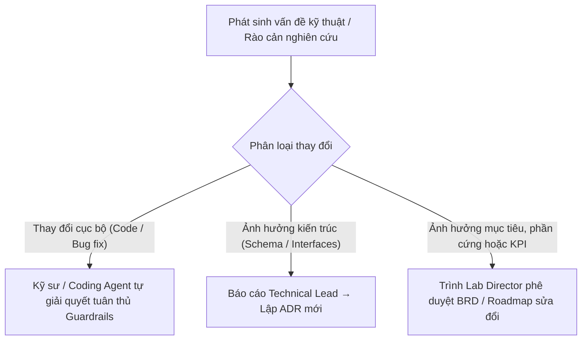

# Stakeholder Register & Governance — Monocular Spatial Vision

> **Layer:** Business Layer (`docs/business/stakeholders.md`)  
> **Project:** Monocular Spatial Vision  
> **Organization:** ASIC Lab, Faculty of Computer Engineering, UIT - VNUHCM  

---

## 1. Stakeholder Matrix & RACI Framework

| Role / Stakeholder | Representative / Group | Responsibility & Scope | RACI Classification |
| :--- | :--- | :--- | :--- |
| **Lab Director / Principal Investigator** | Faculty Lead (ASIC Lab) | Phê duyệt định hướng nghiên cứu, nghiệm thu các cột mốc dự án, quyết định phân bổ phần cứng và tài nguyên tính toán. | **A** (Accountable) |
| **System Architect / Technical Lead** | Lead AI & Robotics Engineer | Thiết kế kiến trúc tổng thể, bảo vệ các bất biến hệ thống (System Invariants), phê duyệt các Architecture Decision Records (ADR). | **R** (Responsible) |
| **Computer Vision / AI Research Engineer** | AI Team Members | Huấn luyện mô hình, tối ưu hóa TensorRT, phát triển pipeline suy luận phát hiện vật thể, đo khoảng cách và 3D Bounding Box. | **R** (Responsible) |
| **Embedded & Robotics Engineer** | Robotics Team Members | Cấu hình driver Pcam 5C trên Raspberry Pi 3, giao tiếp I2C IMU MPU6050, tích hợp ROS 2 nodes và quản lý FastDDS. | **R** (Responsible) |
| **QA & Experimental Benchmark Engineer** | Test & Validation Engineers | Thiết lập khung giá đỡ thí nghiệm, đo đạc lưới ground-truth bằng thước laser Bosch, thu thập log và kiểm chứng KPI. | **R** (Responsible) |
| **AI Coding Agents (Antigravity / agy)** | Autonomous Pair-Programmers | Sinh mã nguồn, viết kịch bản kiểm thử, đồng bộ hóa tài liệu tuân thủ nghiêm ngặt Architecture Guardrails. | **C** (Consulted) / **R** (Responsible) |

*RACI Legend: R = Responsible, A = Accountable, C = Consulted, I = Informed.*

---

## 2. Decision Authority & Escalation Process

