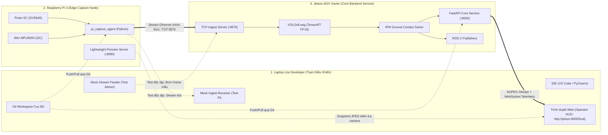

# Release 1: Master Overview & End-to-End Dev Workflow

> **Layer:** Implementation Layer (`docs/implementation/release-1/guide/00-overview-and-dev-workflow.md`)  
> **Release:** Release 1 (Phase 1 Sandbox)  
> **Status:** Approved Baseline — Practical Engineering Standard  

---

## 1. Bản Chất Thực Tế Của Quá Trình Phát Triển (Dev Workflow)

Trong các hệ thống thị giác nhúng và xe tự hành (Robotics/Edge AI), **không một kỹ sư nào viết mã nguồn trực tiếp trên terminal SSH của máy tính nhúng** mà không có công cụ hỗ trợ và phương thức kiểm nghiệm trực quan.

Hệ thống Release 1 bao gồm 3 thực thể phần cứng có vai trò phân định rõ ràng:

---

## 2. Giải Quyết Ba Nút Thắt Cốt Lõi

### Câu hỏi 1: Lấy gì để kiểm chứng việc thu nhận hình ảnh trên Pi 3 và stream về Jetson?
- **Thu nhận Standalone trên Pi 3:**
  1. Kiểm tra driver cấp hệ điều hành: `dmesg | grep ov5640` và `v4l2-ctl --list-devices`.
  2. Bắn ảnh đơn ra file: `v4l2-ctl --stream-mmap --stream-count=1 --stream-to=test.jpg`.
  3. Kiểm nghiệm không cần màn hình: Module `pi_capture_agent` tích hợp cờ `--preview` khởi động HTTP server nội bộ port `8080`. Developer chỉ cần mở laptop vào `http://<pi_ip>:8080/snapshot` để thấy ngay hình ảnh thực tế từ ống kính camera.
  4. Kiểm tra IMU: Chạy `python tools/pi/test_imu.py`, terminal in liên tục góc pitch $\theta$, roll $\phi$; nghiêng board bằng tay thấy góc đổi mượt mà.
- **Kiểm chứng Stream gói tin (Trước khi có Jetson):**
  - Developer khởi động script `tools/laptop/mock_ingest_server.py` ngay trên **Laptop**.
  - Pi 3 stream gói tin nhị phân (Header 36 bytes + ảnh JPEG) qua mạng LAN về IP Laptop.
  - Trên màn hình Laptop, cửa sổ OpenCV/Web lập tức hiện video 30 FPS kèm chỉ số góc nghiêng IMU và bộ đếm rớt gói (Packet Drop Counter). Khi đạt chuẩn, mới chuyển đích stream sang Jetson.

### Câu hỏi 2: Phía Xử lý Trung tâm trên Jetson AGX Xavier — Dev ở đâu, test model bằng gì?
- **Môi trường Dev:** Code được phát triển trên Laptop, đồng bộ sang Jetson qua Git hoặc VS Code Remote-SSH. Trên Jetson, toàn bộ code chạy trong môi trường ảo biệt lập `.venv` (sử dụng `pip` hoặc `uv`).
- **Kiểm nghiệm không cần Pi 3 (Hardware Decoupling):**
  - Jetson pipeline hỗ trợ cờ đầu vào `--source mock` hoặc nhận stream từ `tools/laptop/mock_camera_streamer.py`.
  - Bộ mẫu kiểm thử tĩnh gồm 50 ảnh/video ghi sẵn từ Pcam 5C (`data/samples/`) được bơm trực tiếp vào pipeline để:
    1. Kiểm tra nạp trọng số YOLOv8-seg TensorRT engine (`.engine`).
    2. Đo tốc độ suy luận thuần túy (Inference Latency) và mức tiêu thụ VRAM bằng `tegrastats` hoặc `jtop`.
    3. Xác minh mặt nạ segmentation và tọa độ điểm tiếp xúc mặt sàn $(u, v)$.
    4. Kiểm chứng công thức IPM ra khoảng cách $Z$ mà không cần bất kỳ luồng streaming thời gian thực nào.

### Câu hỏi 3: UI HUD xem ở đâu khi Jetson và Pi đều là máy tính nhúng Headless?
- **Cơ chế Web-based HUD:** 
  - Jetson đóng vai trò là một Backend Server chạy **FastAPI** (tuân thủ cấu trúc `fastapi-backend-scaffold`).
  - Jetson cung cấp Web App tĩnh tại đường dẫn `http://<jetson_ip>:8000/hud`.
  - Developer mở trình duyệt Chrome/Firefox ngay trên **Laptop**, kết nối tới Jetson qua mạng LAN.
  - Web HUD hiển thị:
    1. Luồng video có vẽ lớp phủ (Overlay) 3D Bounding Box và điểm đỏ tiếp xúc sàn `#EF4444` qua MJPEG Stream.
    2. Bảng Telemetry thời gian thực (Pitch, Roll, Height, FPS, Latency) qua WebSocket `/api/v1/ws/telemetry`.
    3. Bản đồ không gian 2D từ trên cao (Bird's Eye View - BEV) dựng bằng HTML5 Canvas.
    4. Ô nhập giá trị thực từ Thước đo Laser để tính toán sai số định lượng tại chỗ.

---

## 3. Bản Đồ Tài Liệu Hướng Dẫn Chi Tiết Trong `docs/implementation/release-1/guide/`

Để hiện thực hóa một cách liền mạch, toàn bộ hướng dẫn được chia nhỏ thành các tài liệu chuyên trách:

1. [00-overview-and-dev-workflow.md](file:///E:/UIT/monocular-spatial-vision/docs/implementation/release-1/guide/00-overview-and-dev-workflow.md): *Tài liệu hiện tại — Bức tranh tổng quan và nguyên lý phân rã phần cứng.*
2. [01-pi3-capture-and-streaming-guide.md](file:///E:/UIT/monocular-spatial-vision/docs/implementation/release-1/guide/01-pi3-capture-and-streaming-guide.md): *Hướng dẫn thiết lập driver OV5640, nối dây IMU MPU6050, mã nguồn đọc camera/IMU, test độc lập trên Pi và stream về Laptop.*
3. [02-jetson-backend-service-guide.md](file:///E:/UIT/monocular-spatial-vision/docs/implementation/release-1/guide/02-jetson-backend-service-guide.md): *Hướng dẫn dựng FastAPI Backend trên Jetson theo chuẩn `fastapi-backend-scaffold`, tích hợp Ingest TCP, TensorRT, IPM Solver.*
4. [03-web-hud-and-laptop-inspection.md](file:///E:/UIT/monocular-spatial-vision/docs/implementation/release-1/guide/03-web-hud-and-laptop-inspection.md): *Kiến trúc giao diện Web HUD, MJPEG streaming, WebSocket telemetry và cách theo dõi hệ thống từ Laptop.*
5. [04-step-by-step-integration-and-testing-plan.md](file:///E:/UIT/monocular-spatial-vision/docs/implementation/release-1/guide/04-step-by-step-integration-and-testing-plan.md): *Kế hoạch kiểm thử 6 bước tuần tự từ cô lập từng node đến tích hợp toàn chu trình và đo đối chuẩn laser.*
6. [05-folder-structure-and-code-skeleton.md](file:///E:/UIT/monocular-spatial-vision/docs/implementation/release-1/guide/05-folder-structure-and-code-skeleton.md): *Cấu trúc thư mục mã nguồn hoàn chỉnh, cấu hình `pyproject.toml`, môi trường ảo cách ly và mô hình service modular.*
