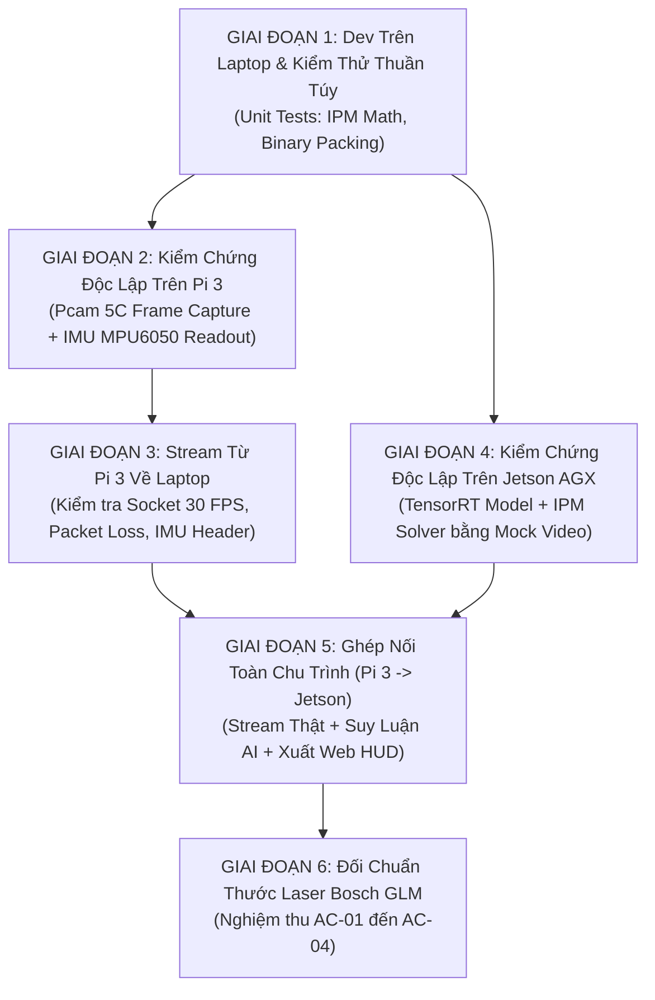

# Kế Hoạch Tích Hợp & Kiểm Thử Từng Bước (Step-by-Step Test Plan)

> **Layer:** Implementation Layer (`docs/implementation/release-1/guide/04-step-by-step-integration-and-testing-plan.md`)  
> **Release:** Release 1 (Phase 1 Sandbox)  
> **Nguyên tắc cốt lõi:** Cô lập từng phần cứng (Hardware Decoupling), kiểm chứng qua Laptop trước khi ghép nối hệ thống.  

---

## 1. Bản Đồ 6 Bước Tích Hợp (6-Phase Phased Rollout)



---

## 2. Chi Tiết Từng Giai Đoạn Triển Khai

### Giai Đoạn 1: Phát Triển Trên Laptop & Viết Unit Test Cục Bộ
- **Mục tiêu:** Đảm bảo toàn bộ công thức toán học và logic đóng/mở gói nhị phân chính xác 100% trước khi nạp vào máy tính nhúng.
- **Hành động:**
  1. Viết hàm thuần túy `pack_frame_header()` và `unpack_frame_header()` trong `backend/app/services/ingest_service.py`.
  2. Viết hàm giải toán hình học `compute_ipm_distance()` trong `backend/app/services/geometry_service.py`.
  3. Chạy kiểm thử pytest trên Laptop:
     ```bash
     pytest tests/unit/test_binary_protocol.py tests/unit/test_ipm_solver.py -v
     ```
  4. **Tiêu chuẩn vượt qua (Gate 1):** 100% test cases pass, bao gồm cả các ca kiểm thử biên (góc nghiêng âm, điểm nằm ngoài đường chân trời).

---

### Giai Đoạn 2: Kiểm Chứng Độc Lập Trên Raspberry Pi 3
- **Mục tiêu:** Xác nhận phần cứng camera và cảm biến IMU hoạt động bình thường, không phụ thuộc vào mạng.
- **Hành động:**
  1. Đẩy code lên Git từ Laptop, SSH vào Pi 3 và kéo về (`git pull`).
  2. Kích hoạt môi trường `.venv` trên Pi 3.
  3. Chạy `python -m pi_capture_agent.cli --mode snapshot` $\to$ Kiểm tra file ảnh lưu tại `test.jpg`.
  4. Chạy `python -m pi_capture_agent.cli --mode test-imu` $\to$ Xác nhận gia tốc $a_x, a_y, a_z$ và góc pitch/roll thay đổi khi xoay board.
  5. Mở diagnostic HTTP server: Xem ảnh chụp trực tiếp qua trình duyệt Laptop tại `http://<pi_ip>:8080/test.jpg`.
  6. **Tiêu chuẩn vượt qua (Gate 2):** Ảnh không nhiễu, tiêu cự nét, IMU phản hồi tức thời ở tần số $\ge 50\text{Hz}$.

---

### Giai Đoạn 3: Kiểm Chứng Stream Từ Pi 3 Về Laptop
- **Mục tiêu:** Xác nhận module truyền socket mạng hoạt động ổn định, đạt 30 FPS trước khi nối với Jetson.
- **Hành động:**
  1. Trên Laptop: Chạy `python tools/laptop/mock_ingest_server.py --port 9876`.
  2. Trên Pi 3: Chạy `python -m pi_capture_agent.cli --mode stream --host <IP_LAPTOP> --port 9876`.
  3. Quan sát màn hình Laptop: Cửa sổ OpenCV hiển thị luồng video 30 FPS, in log góc pitch/roll đồng bộ trên từng frame.
  4. Thử nghiệm rút cáp mạng Ethernet và cắm lại $\to$ Xác nhận Pi tự động kết nối lại (auto-reconnect) trong $< 3\text{ giây}$.
  5. **Tiêu chuẩn vượt qua (Gate 3):** Tỷ lệ rớt gói $< 0.1\%$ trong 10 phút, độ trễ truyền gói qua mạng có dây $< 10\text{ms}$.

---

### Giai Đoạn 4: Kiểm Chứng Độc Lập Trên Jetson AGX Xavier (Hardware Decoupling)
- **Mục tiêu:** Hoàn thiện pipeline AI và khôi phục không gian 3D trên Jetson mà không cần Pi 3 phải bật.
- **Hành động:**
  1. Biên dịch engine YOLOv8-seg TensorRT FP16 trên Jetson GPU:
     ```bash
     trtexec --onnx=yolov8n-seg.onnx --saveEngine=weights/yolov8n-seg.engine --fp16
     ```
  2. Bơm video/ảnh mẫu từ Laptop sang Jetson bằng công cụ giả lập:
     ```bash
     python tools/laptop/mock_camera_streamer.py --video data/samples/test_lab.mp4 --target-host <IP_JETSON> --port 9876
     ```
  3. Khởi động FastAPI backend trên Jetson: `uvicorn app.main:app --host 0.0.0.0 --port 8000`.
  4. Mở trình duyệt trên Laptop: `http://<jetson_ip>:8000/hud` $\to$ Kiểm tra hình ảnh video, bounding box 3D và cự ly $Z$ tính toán hiển thị mượt mà.
  5. **Tiêu chuẩn vượt qua (Gate 4):** Thời gian suy luận TensorRT $\le 20\text{ms}$ ($\ge 50\text{ FPS}$), RAM tiêu thụ $\le 4.5\text{ GB}$.

---

### Giai Đoạn 5: Ghép Nối Toàn Chu Trình (End-to-End Integration)
- **Mục tiêu:** Hệ thống vật lý hoàn chỉnh: Pi 3 (Camera + IMU) $\to$ Switch/Cáp mạng $\to$ Jetson AGX Xavier.
- **Hành động:**
  1. Cấu hình IP đích trên Pi 3 trỏ trực tiếp vào IP Jetson: `host: 192.168.1.20`.
  2. Khởi động dịch vụ trên Jetson: `systemctl start mono_perception_backend`.
  3. Khởi động dịch vụ trên Pi 3: `systemctl start pi_capture_agent`.
  4. Mở Web HUD trên Laptop: `http://192.168.1.20:8000/hud`.
  5. Đo đạc các chỉ số:
     - End-to-end Latency (từ lúc Pi chụp đến khi Jetson xuất kết quả): Đo bằng Timestamp nhị phân.
     - Frame drop rate qua TCP Ring Buffer.
  6. **Tiêu chuẩn vượt qua (Gate 5):** Thỏa mãn AC-01 (Drop rate $< 0.1\%$) và AC-03 (Độ trễ $\le 60\text{ms}$).

---

### Giai Đoạn 6: Đối Chuẩn Thước Laser Bosch GLM (Benchmark Ground Truth)
- **Mục tiêu:** Nghiệm thu độ chính xác đo khoảng cách và khả năng bù trừ rung lắc IMU.
- **Hành động:**
  1. Đặt vật thể kiểm thử (người thật, ghế văn phòng, hộp chuẩn) tại các mốc cự ly: $0.5\text{m}, 1.0\text{m}, 1.5\text{m}, 2.0\text{m}, 2.5\text{m}, 3.0\text{m}$.
  2. Chiếu thước laser Bosch GLM ($\pm 1.5\text{mm}$) vào tâm đáy vật thể, ghi nhận khoảng cách thực $d_{\text{gt}}$.
  3. Gõ giá trị vào ô nhập trên Web HUD (hoặc dùng script `python tools/benchmark/eval_laser.py`).
  4. **Thử nghiệm nghiêng động (Tilt Test):** Dùng tay tác động làm nghiêng giá đỡ camera $\pm 5^\circ$ $\to$ Ghi nhận giá trị đo $Z_{\text{pred}}$ trước và sau khi nghiêng.
  5. **Tiêu chuẩn nghiệm thu toàn diện (Gate 6):**
     - [x] $\text{AbsRel} \le 5.0\%$ trên toàn bộ dải $0.5\text{m} - 3.0\text{m}$ (AC-02).
     - [x] Độ lệch cự ly khi nghiêng $\pm 5^\circ$ không vượt quá $1.0\%$ (AC-04).
     - [x] Script tự động xuất báo cáo nghiệm thu dạng Markdown tại `reports/benchmark_release1_results.md`.
