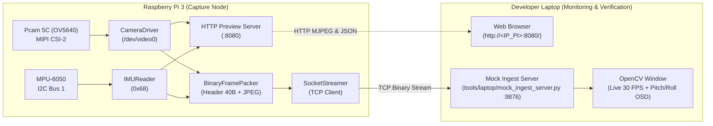

# Hướng Dẫn Chi Tiết: Triển Khai Raspberry Pi 3 & Kiểm Thử Trên Laptop

> **Layer:** Implementation Layer (`docs/implementation/release-1/guide/06-pi3-step-by-step-bringup-and-verification-guide.md`)  
> **Release:** Release 1 (Phase 1 Sandbox)  
> **Target Hardware:** Raspberry Pi 3 Model B+ (Pcam 5C / OV5640 + MPU-6050) & Developer Laptop  
> **Tài liệu tham chiếu:** [AGENTS.md](file:///D:/ASICLAB/monocular-spatial-vision/AGENTS.md), [01-pi3-capture-and-streaming-guide.md](file:///D:/ASICLAB/monocular-spatial-vision/docs/implementation/release-1/guide/01-pi3-capture-and-streaming-guide.md)  

---

## 1. Sơ Đồ Kiến Trúc Luồng Kiểm Thử (End-to-End Bring-Up Flow)

Toàn bộ quy trình kiểm thử giai đoạn 1 tuân thủ nguyên tắc **Hardware Decoupling** — cô lập và xác nhận Raspberry Pi 3 hoạt động ổn định với Developer Laptop trước khi ghép nối vào máy chủ AI Jetson AGX Xavier.



---

## 2. Bước 1: Clone Repository Về Raspberry Pi 3

### 2.1. Đăng nhập SSH vào Raspberry Pi 3
Từ terminal máy tính cá nhân (Command Prompt, PowerShell, Git Bash hoặc Linux Terminal):
```bash
ssh pi@<IP_RASPBERRY_PI>
# Ví dụ: ssh pi@192.168.1.50
```

> [!TIP]
> Nếu bạn chưa biết IP của Raspberry Pi 3, trên máy tính có thể quét mạng LAN bằng lệnh:
> - Windows: `arp -a | findstr "b8-27-eb"` hoặc `arp -a | findstr "dc-a6-32"` (dải MAC của Raspberry Pi).
> - Hoặc thử SSH qua mDNS: `ssh pi@raspberrypi.local`.

### 2.2. Kiểm tra Git và Clone Repository
Sau khi đăng nhập thành công vào Pi 3:
```bash
# 1. Cập nhật chỉ mục gói hệ thống cơ bản
sudo apt update

# 2. Cài đặt git và curl nếu chưa có
sudo apt install -y git curl

# 3. Clone repository từ GitHub / GitLab về thư mục người dùng
cd ~
git clone https://github.com/<your-org-or-username>/monocular-spatial-vision.git

# 4. Di chuyển vào thư mục dự án và chuyển sang nhánh phát triển
cd monocular-spatial-vision
git checkout vuDev
git pull origin vuDev
```

Kiểm tra thư mục trên Pi 3:
```bash
ls -la services/pi_capture_agent
```
Xác nhận có đầy đủ các file: `pyproject.toml`, `README.md`, thư mục `pi_capture_agent/` chứa `camera.py`, `imu.py`, `packer.py`, `streamer.py`, `cli.py`.

---

## 3. Bước 2: Kiểm Tra & Cài Đặt `uv` Trên Raspberry Pi 3

Theo quy tắc trong [AGENTS.md](file:///D:/ASICLAB/monocular-spatial-vision/AGENTS.md), **tuyệt đối không cài đặt thư viện vào Python toàn cục của hệ điều hành**. Dự án yêu cầu môi trường ảo biệt lập (`.venv`) quản lý bằng `uv` hoặc `venv`.

### 3.1. Kiểm tra kiến trúc CPU của Pi 3
```bash
uname -m
```
- Nếu trả về `aarch64`: Hệ điều hành 64-bit (Raspberry Pi OS 64-bit).
- Nếu trả về `armv7l`: Hệ điều hành 32-bit (Raspberry Pi OS 32-bit).

### 3.2. Cài đặt `uv` (Astral Python Package Manager)
Cài đặt công cụ `uv` bằng script chính thức của Astral:
```bash
curl -LsSf https://astral.sh/uv/install.sh | sh
```

Nạp biến môi trường của `uv` vào shell hiện tại:
```bash
source $HOME/.cargo/env
# Hoặc: export PATH="$HOME/.local/bin:$PATH"
```

Xác nhận cài đặt thành công:
```bash
uv --version
# Kết quả mong đợi: uv 0.x.x (hoặc mới hơn)
```

> [!NOTE]
> **Phương án dự phòng (Fallback):** Nếu hệ điều hành là 32-bit `armv7l` và bản pre-built của `uv` không hỗ trợ kiến trúc này, bạn hoàn toàn có thể dùng module `venv` tiêu chuẩn có sẵn của Python 3:
> ```bash
> sudo apt install -y python3-venv python3-pip
> ```

---

## 4. Bước 3: Khởi Tạo Môi Trường Ảo & Cài Đặt Dependencies

### 4.1. Khởi tạo `.venv` biệt lập bên trong `services/pi_capture_agent`
Di chuyển vào thư mục của service:
```bash
cd ~/monocular-spatial-vision/services/pi_capture_agent
```

**Cách A: Sử dụng `uv` (Nhanh, tối ưu tài nguyên trên Pi 3):**
```bash
# Tạo môi trường ảo
uv venv .venv

# Kích hoạt môi trường ảo
source .venv/bin/activate

# Cài đặt các thư viện cần thiết
uv pip install -e .
```

**Cách B: Sử dụng Python `venv` tiêu chuẩn (Nếu không dùng `uv`):**
```bash
python3 -m venv .venv
source .venv/bin/activate

pip install --upgrade pip
pip install -e .
```

### 4.2. Kiểm tra xác nhận các gói phụ thuộc
Khi môi trường `(.venv)` đã kích hoạt, chạy lệnh sau để kiểm tra:
```bash
python -c "import cv2, smbus2, yaml, numpy; print('✓ All dependencies loaded successfully!')"
```
Kết quả in ra `✓ All dependencies loaded successfully!` nghĩa là môi trường đã sẵn sàng 100%.

---

## 5. Bước 4: Kiểm Tra Phần Cứng Cấp Thấp (Hardware Sanity Check)

Trước khi chạy mã nguồn ứng dụng, bạn cần kiểm tra chắc chắn Linux kernel đã nhận diện đúng chân cắm vật lý của Pcam 5C và cảm biến MPU-6050.

### 5.1. Chạy script chẩn đoán tự động
Dự án đã tích hợp sẵn kịch bản kiểm tra toàn diện:
```bash
# Từ thư mục gốc dự án
cd ~/monocular-spatial-vision
bash tools/pi/check_hardware.sh
```

Hoặc sử dụng chính lệnh CLI của `pi_capture_agent`:
```bash
cd ~/monocular-spatial-vision/services/pi_capture_agent
source .venv/bin/activate
python -m pi_capture_agent.cli --mode check-hardware
```

### 5.2. Đọc và phân tích kết quả chẩn đoán
Bảng đối chiếu kết quả mong đợi:

| Thành phần | Lệnh cấp thấp | Kết quả đạt chuẩn (PASS) | Cách xử lý nếu lỗi (FAIL) |
| :--- | :--- | :--- | :--- |
| **I2C Interface** | `ls /dev/i2c-1` | Tệp `/dev/i2c-1` tồn tại | Chạy `sudo raspi-config nonint do_i2c 0` và reboot |
| **MPU-6050** | `i2cdetect -y 1` | Thấy số **`68`** xuất hiện trong bảng lưới | Kiểm tra 4 dây nối: 3.3V (Pin 1), GND (Pin 6), SDA (Pin 3), SCL (Pin 5) |
| **V4L2 Video** | `ls -l /dev/video0` | Tệp `/dev/video0` tồn tại | Kiểm tra cáp dẹt 15-pin FFC cắm vào cổng MIPI CSI |
| **Driver OV5640** | `dmesg \| grep -i ov5640` | `ov5640 ... probed successfully` | Thêm `dtoverlay=ov5640` vào `/boot/firmware/config.txt` và reboot |
| **Nhóm quyền** | `groups` | Xuất hiện `video` và `i2c` | Chạy `sudo usermod -aG video,i2c $USER` |

---

## 6. Bước 5: Chạy Các Chế Độ Kiểm Thử Trên Raspberry Pi 3

Package `pi_capture_agent` cung cấp 4 chế độ chạy độc lập từ đơn giản đến toàn diện. Hãy thực hiện theo trình tự nấc thang dưới đây:

### Nấc 1: Kiểm thử cảm biến IMU thời gian thực (`--mode test-imu`)
Chế độ này đọc cảm biến MPU-6050 liên tục ở tần số $50\text{Hz}$ mà **không cần mở camera**:
```bash
python -m pi_capture_agent.cli --mode test-imu
```

**Màn hình terminal trên Pi 3 sẽ in ra:**
```text
Time         | Ax (g)  Ay (g)  Az (g)  | Pitch (deg)  Roll (deg)   | Gx (dps) Gy (dps) Gz (dps)
----------------------------------------------------------------------------------------
00.02s       | -0.22   +0.01   +0.97   |  +12.48        +0.12     |   +0.1    -0.1    +0.0
00.04s       | -0.21   +0.00   +0.98   |  +12.51        +0.09     |   +0.0    +0.0    +0.0
```

**Thao tác kiểm chứng vật lý:**
1. Cầm cụm camera nghiêng chúc đầu xuống sàn $\to$ Góc **Pitch** tăng dương ($+15^\circ, +20^\circ\dots$).
2. Nghiêng ngửa camera lên trần nhà $\to$ Góc **Pitch** giảm về $0^\circ$ hoặc âm.
3. Nghiêng camera nghiêng sang trái/phải $\to$ Góc **Roll** thay đổi tương ứng.
4. Nhấn `Ctrl + C` để thoát. Chương trình sẽ in ra tổng số mẫu và tần số lấy mẫu trung bình (đạt xấp xỉ $\ge 50\text{ Hz}$).

---

### Nấc 2: Chụp ảnh đơn kiểm tra tiêu cự & góc nhìn (`--mode snapshot`)
Chế độ này kích hoạt camera Pcam 5C (OV5640), đợi 5 khung hình để cảm biến tự động cân bằng trắng và phơi sáng (Auto-Exposure / AWB), chụp 1 ảnh $1280 \times 720$ và đọc tư thế IMU tại thời điểm chụp:
```bash
python -m pi_capture_agent.cli --mode snapshot --output ./data/test_frame.jpg
```

**Kết quả hiển thị trên terminal:**
```text
================ SNAPSHOT RESULT ================
Saved snapshot: ./data/test_frame.jpg (68412 bytes)
Image Resolution: 1280x720
Timestamp: 1728468123456789000 ns
IMU Telemetry: Pitch=+12.45 deg, Roll=+0.08 deg, Accel=(-0.22, 0.01, 0.98)g
================================================
```

---

### Nấc 3: Bật Diagnostic Web HUD trên Pi 3 (`--mode preview`)
> [!IMPORTANT]
> Đây là tính năng đặc biệt giúp bạn quan sát video và cảm biến từ Laptop mà **không cần cắm màn hình HDMI vào Pi 3** và **không cần cài đặt VNC hay X11 Desktop**.

Chạy server HTTP chẩn đoán trên Pi 3:
```bash
python -m pi_capture_agent.cli --mode preview --preview-port 8080
```

Terminal sẽ thông báo:
```text
================ PREVIEW SERVER STARTED ================
HTTP Preview running on port 8080
Access from developer laptop browser:
  👉  http://<pi_ip>:8080/              (Interactive Web HUD)
  👉  http://<pi_ip>:8080/snapshot.jpg  (Raw Single JPEG)
  👉  http://<pi_ip>:8080/telemetry     (JSON IMU telemetry)
Press Ctrl+C to terminate preview server.
========================================================
```

---

### Nấc 4: Kích hoạt luồng truyền mạng TCP Socket (`--mode stream`)
Chế độ sản xuất chính: thu nhận video $30\text{ FPS}$, đọc tư thế IMU tức thời, đóng gói nhị phân 40 bytes Header chuẩn Big-Endian (`>HHIQffIIII`) và truyền sang máy chủ ingest qua TCP socket:
```bash
python -m pi_capture_agent.cli --mode stream --host <IP_LAPTOP> --port 9876
```

---

## 7. Bước 6: Giám Sát & Kiểm Tra Trên Laptop Của Developer

### 7.1. Cách 1: Xem trực tiếp qua trình duyệt Web (Không cần cài thêm gì)
Khi Pi 3 đang chạy ở chế độ `--mode preview` (Bước 5, Nấc 3):
1. Mở trình duyệt bất kỳ trên Laptop (Chrome, Edge, Firefox).
2. Nhập URL: `http://<IP_RASPBERRY_PI>:8080/` (ví dụ: `http://192.168.1.50:8080/`).
3. **Màn hình hiển thị:**
   - Khung hình video trực tiếp từ Pcam 5C ở độ phân giải $1280 \times 720$.
   - Các bảng số liệu IMU cập nhật theo thời gian thực:
     - **Pitch Angle ($\theta$):** Góc chúc xuống của camera.
     - **Roll Angle ($\phi$):** Góc nghiêng ngang.
     - **Gia tốc 3 trục:** $[A_x, A_y, A_z]$ theo đơn vị $g$.
     - **Tốc độ khung hình (FPS):** Tần số render của camera.

> [!TIP]
> Bạn có thể xoay nhẹ thấu kính của camera Pcam 5C trong khi nhìn màn hình Laptop để điều chỉnh tiêu cự (focus) cho đến khi ảnh sắc nét rõ từng chi tiết trên mặt sàn.

---

### 7.2. Cách 2: Tải ảnh chụp về Laptop để lưu trữ
Nếu chụp qua `--mode snapshot`, bạn có thể tải ảnh từ Pi 3 về Laptop bằng lệnh SCP (chạy trên terminal của Laptop):
```bash
# Chạy trên máy tính Laptop:
scp pi@<IP_RASPBERRY_PI>:~/monocular-spatial-vision/services/pi_capture_agent/data/test_frame.jpg ./test_frame.jpg
```
Hoặc mở trực tiếp từ trình duyệt khi Pi đang bật preview server: `http://<IP_RASPBERRY_PI>:8080/snapshot.jpg`.

---

### 7.3. Cách 3: Kiểm thử kết nối TCP Socket với Mock Ingest Server (Phase 3 Gate)
Để chuẩn bị cho việc kết nối vào Jetson AGX Xavier, bạn hãy dùng chính Laptop làm "Máy chủ giả lập":

1. **Trên Laptop của bạn:**
   Mở terminal tại thư mục gốc của dự án `monocular-spatial-vision` trên Laptop, chạy Mock Ingest Server:
   ```bash
   python tools/laptop/mock_ingest_server.py --port 9876
   ```
   Server sẽ in ra:
   ```text
   [*] Mock Ingest Server listening on 0.0.0.0:9876...
   ```

2. **Trên Raspberry Pi 3 (qua SSH):**
   Khởi động luồng stream trỏ đến địa chỉ IP của Laptop:
   ```bash
   python -m pi_capture_agent.cli --mode stream --host <IP_CUA_LAPTOP> --port 9876
   ```

3. **Quan sát và nghiệm thu trên Laptop:**
   - Cửa sổ OpenCV Desktop mang tên `Pi 3 Stream (Mock Ingest on Laptop)` sẽ tự động mở lên.
   - Video hiển thị mượt mà với OSD hiển thị:
     `Frame: #145 | FPS: 30.0 | Pitch: 12.45 deg | Roll: 0.10 deg`.
   - **Thử nghiệm ngắt mạng (Resilience Test):** Rút cáp mạng Ethernet ra $\to$ tiến trình trên Pi 3 chuyển sang trạng thái `[RECONNECTING]` với Exponential Backoff mà không bị crash. Cắm lại cáp $\to$ luồng truyền tự động phục hồi trong $< 3\text{ giây}$.

---

## 8. Bảng Xử Lý Sự Cố Thường Gặp (Troubleshooting Guide)

| Hiện tượng lỗi | Nguyên nhân gốc rễ | Cách khắc phục triệt để |
| :--- | :--- | :--- |
| `i2cdetect` không thấy địa chỉ `68` | Dây SDA/SCL cắm nhầm chân hoặc chưa cấp nguồn 3.3V | Kiểm tra lại sơ đồ chân GPIO: VCC cắm Pin 1 (3.3V), GND cắm Pin 6, SDA cắm Pin 3, SCL cắm Pin 5. Tuyệt đối không cắm vào chân 5V. |
| `FileNotFoundError: /dev/video0` | Chưa cấu hình Device Tree Overlay cho chip OV5640 | Mở `/boot/firmware/config.txt` (hoặc `/boot/config.txt`), thêm dòng `dtoverlay=ov5640`, lưu lại và chạy `sudo reboot`. |
| Cáp camera Pcam 5C cắm ngược | Mặt chân đồng của cáp tiếp xúc không đúng hướng | Rút cáp: Mặt tiếp xúc chân đồng màu vàng phải quay về phía cổng HDMI, mặt đệm màu xanh quay về phía cổng USB/Ethernet. Khóa chốt cáp cẩn thận. |
| `PermissionError: [Errno 13]` | User `pi` chưa được cấp quyền truy cập thiết bị phần cứng | Chạy: `sudo usermod -aG video,i2c $USER`, sau đó `logout` SSH và đăng nhập lại. |
| Laptop không nhận được socket (`Connection refused`) | Tường lửa Windows chặn port 9876 hoặc sai IP | Trên Laptop: Vào *Windows Defender Firewall* cho phép Python nhận kết nối Inbound qua port 9876, hoặc tạm thời tắt Firewall mạng Private để test. Đảm bảo Pi 3 và Laptop ping thấy nhau. |
| Hình ảnh camera bị tối hoặc ngược màu | Thư viện V4L2 dùng nhầm định dạng YUYV | Cấu hình trong `configs/capture_pi.yaml` đặt `pixel_format: "MJPG"`. Chip OV5640 xuất trực tiếp MJPG giúp Pi 3 giải phóng tải CPU. |

---

## 9. Checklist Nghiệm Thu Hoàn Tất Giai Đoạn 1 (Sign-Off Gate)

Trước khi chuyển sang tích hợp với Jetson AGX Xavier (Giai đoạn 4 & 5), xác nhận các tiêu chí sau:

- [ ] Lệnh `python -m pi_capture_agent.cli --mode check-hardware` đạt $100\%$ PASS.
- [ ] IMU MPU-6050 đo góc Pitch và Roll phản hồi tức thời ở tần số $\ge 50\text{Hz}$.
- [ ] Ảnh snapshot Pcam 5C rõ nét, tiêu cự chuẩn, không bị nhiễu màu.
- [ ] Trình duyệt Laptop mở được Web HUD tại `http://<IP_PI_3>:8080/`.
- [ ] Luồng stream TCP Socket về Laptop đạt ổn định $30\text{ FPS}$ ở độ phân giải $1280 \times 720$.
- [ ] Tự động kết nối lại thành công khi bị rút và cắm lại dây mạng.
