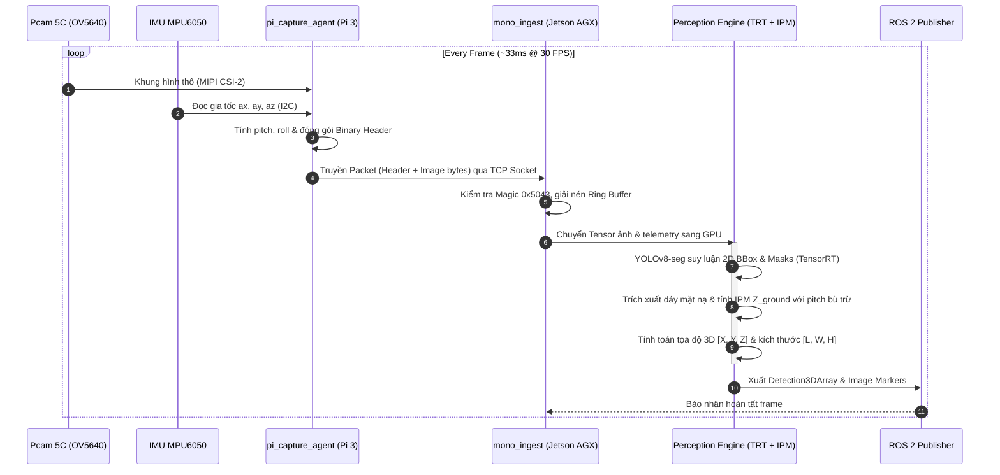
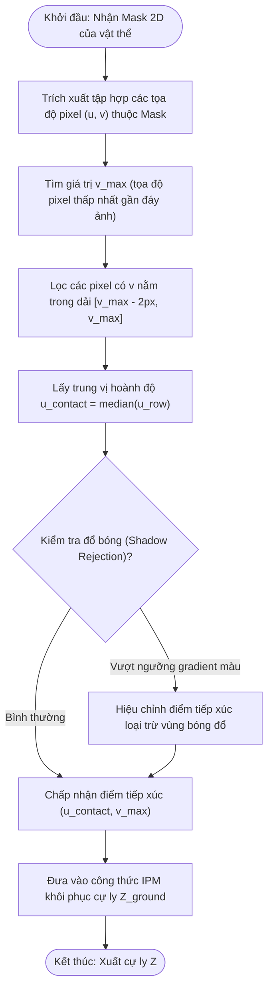

# Technical Design — Release 1 Pipeline

> **Layer:** Implementation Layer (`docs/implementation/release-1/technical-design.md`)  
> **Release:** Release 1 (Phase 1 Sandbox)  
> **Status:** Approved Baseline  

---

## 1. Frame Processing Sequence Diagram

---

## 2. Activity Swimlane for Ground Contact Point Extraction

