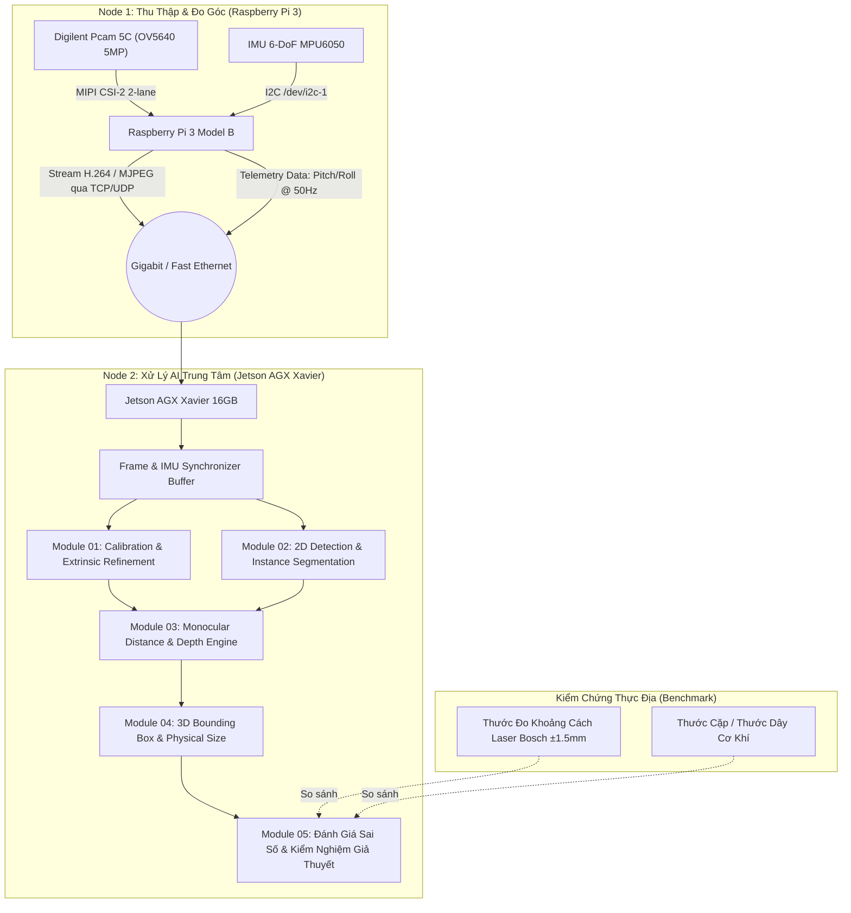

# BÁO CÁO NGHIÊN CỨU & THIẾT KẾ HỆ THỐNG MODULE CAMERA ĐƠN (PCAM 5C + RASPBERRY PI 3 + JETSON AGX XAVIER)

| Thông Tin Chung | Chi Tiết |
| :--- | :--- |
| **Dự án** | Nghiên cứu Nhận thức Không gian 3D Đơn kính (Monocular 3D Perception) cho Mobile Robot |
| **Giai đoạn** | **Phase 1: Nghiên cứu Độc lập (Standalone Sandbox)** — Kiểm chứng giả thuyết trước khi tích hợp hệ thống |
| **Phần cứng thu nhận** | Digilent Pcam 5C (OmniVision OV5640 5MP, cáp FFC 15-pin) + Raspberry Pi 3 Model B/B+ |
| **Cảm biến bổ trợ** | IMU 6-DoF MPU6050 (gắn cố định trên cụm camera để đo vector trọng lực & góc nghiêng) |
| **Nền tảng tính toán AI**| NVIDIA Jetson AGX Xavier 16GB (Developer Kit / Auvidea X221-AI Carrier Board) |
| **Ràng buộc vật lý** | Chiều cao lắp đặt camera ($h_c$), góc chúc pitch ($\theta$), góc nghiêng roll ($\phi \approx 0$) được cố định và đo đạc chuẩn xác |
| **Mục tiêu nghiên cứu** | Kiểm chứng thực nghiệm các mô hình toán học & học sâu (Pretrained weights) về 2D/3D Object Detection, Depth/Distance Estimation, 3D Bounding Box và Kích thước vật thể |
| **Thư mục lưu trữ** | `implementations/single-cam/ai/` |

---

## 1. Giới Thiệu & Tuyên Bố Bài Toán Nghiên Cứu

### 1.1. Bối cảnh và Tính độc lập của Giai đoạn 1
Trong tổng thể dự án Mobile Robot (sử dụng Jetson AGX Xavier, ROS 2 Foxy, LiDAR RPLIDAR S2E, IMU BNO055, vi sai STM32 hoverboard), thị giác máy tính đóng vai trò nhận thức ngữ nghĩa (semantic perception) và bổ khuyết các vùng mù mà LiDAR 2D không thể quét tới (vật thể nằm trên/dưới mặt phẳng quét 2D, biển báo, màu sắc, nhận diện chủng loại vật thể).

Tuy nhiên, việc tích hợp đồng thời nhiều cảm biến ngay từ đầu gây ra hiện tượng **ghép kênh sai số (coupled errors)**: rất khó xác định sai số khoảng cách là do thuật toán thị giác, do trôi dạt odometry bánh xe, do rung lắc khung gầm, hay do trễ mạng DDS. Do đó, **Giai đoạn 1 được quy định là một công trình nghiên cứu độc lập (Standalone Research)**:
1. Cụm camera Pcam 5C và Raspberry Pi 3 được gắn trên giá đỡ thí nghiệm cơ khí cứng vững (rigid test rig), kiểm soát tuyệt đối chiều cao $h_c$ và góc nghiêng $\theta$.
2. Không phụ thuộc vào chuyển động của robot hay dữ liệu LiDAR; mọi nguồn tham chiếu đo lường (Metric Scale Ground-Truth) được đo trực tiếp bằng thước laser quang học (Optical Laser Rangefinder) và lưới tọa độ mặt sàn chuẩn.
3. Jetson AGX Xavier đóng vai trò "Bộ não tính toán" (AI Compute Engine), tiếp nhận luồng dữ liệu hình ảnh và góc nghiêng tức thời qua mạng nội bộ tốc độ cao, thực thi suy luận từ các mô hình học sâu có sẵn trọng số (Pretrained Models) được tối ưu hóa qua TensorRT.

### 1.2. Giả thuyết Khoa học (Scientific Hypotheses)
Nghiên cứu này được dẫn dắt bởi 4 giả thuyết khoa học cốt lõi:

*   **Giả thuyết $H_1$ (Hình học mặt phẳng sàn - IPM):** Khi chiều cao camera $h_c$ và góc pitch $\theta$ được cố định và hiệu chuẩn chính xác, mô hình chiếu phối cảnh ngược (Inverse Perspective Mapping) có thể ước lượng khoảng cách $Z$ tới điểm tiếp xúc mặt đất của vật thể với sai số $\text{AbsRel} < 5\%$ trong phạm vi $0.5\text{m} - 3.0\text{m}$.
*   **Giả thuyết $H_2$ (Bù trừ góc nghiêng động bằng IMU MPU6050):** Gia tốc kế của MPU6050 gắn đồng trục với thấu kính camera có khả năng đo trực tiếp vector trọng lực để cập nhật góc $\theta(t)$ theo thời gian thực, triệt tiêu sai số đo khoảng cách phát sinh do biến dạng cơ khí hoặc độ võng của giá đỡ.
*   **Giả thuyết $H_3$ (Trích xuất biên tiếp xúc sàn qua Instance Segmentation):** Sử dụng mạng phân đoạn thực thể (Instance Segmentation như YOLOv8-seg/FastSAM) thay vì Bounding Box 2D thông thường sẽ giúp loại bỏ hiện tượng sai lệch điểm chạm sàn do đổ bóng hoặc che khuất cục bộ, giảm phương sai sai số $\sigma^2_Z$ đi ít nhất $40\%$.
*   **Giả thuyết $H_4$ (Hiệu chuẩn quy mô cho Foundation Metric Depth):** Mô hình Monocular Metric Depth Pretrained (Depth Anything V2 Metric) khi chạy trên Jetson có thể ước lượng chiều sâu của các vật cản lơ lửng không chạm sàn (như mặt bàn, gờ nhô) mà hình học IPM bất lực, đạt sai số $\text{AbsRel} < 10\%$ sau khi được neo tỉ lệ (scale-anchored) bằng mặt sàn.



---

## 2. Thiết Kế & Cấu Hình Phần Cứng (Hardware Setup)

### 2.1. Cụm Cảm biến Pcam 5C & Kết nối Raspberry Pi 3
*   **Cảm biến hình ảnh:** Digilent Pcam 5C trang bị cảm biến OmniVision OV5640 5 Megapixel (kích thước pixel $1.4\mu m \times 1.4\mu m$, cảm biến $1/4"$).
*   **Giao tiếp vật lý:** Cáp bẹ FFC 15-pin, pitch 1.0mm, chuẩn MIPI CSI-2 (2 làn dữ liệu `data_lane` + 1 làn xung nhịp `clock_lane`).
*   **Cơ chế cắm cáp trên Raspberry Pi 3:**
    *   Cổng CSI trên Pi 3 nằm giữa cổng HDMI và cổng Audio jack 3.5mm.
    *   **Quy tắc tiếp xúc:** Mặt có các tiếp điểm kim loại màu vàng của cáp bẹ hướng về phía cổng HDMI; mặt màu xanh (stiffener) hướng về cổng Ethernet/USB.
    *   Khóa chốt cáp (collar clip) phải được kéo nhẹ lên trước khi đút cáp, căn chỉnh thẳng hàng tuyệt đối và ấn khóa đều 2 bên để tránh mất xung nhịp CSI hoặc lệch pha vi sai.

### 2.2. Đấu nối Cảm biến IMU MPU6050 với Raspberry Pi 3
MPU6050 được gắn cố định cứng vững ngay trên đế giữ module Pcam 5C (cùng một khối kim loại/in 3D, không qua khớp giảm chấn lỏng lẻo) để trục $Y$ của IMU trùng hướng quang trục camera ($Z_C$) hoặc có ma trận quay $R_{imu}^{cam}$ xác định.

*   **Sơ đồ chân giao tiếp I2C:**
    *   `VCC` của MPU6050 $\rightarrow$ Chân 1 (3.3V Power) của Raspberry Pi 3. *(Lưu ý: Không cắm 5V để tránh hư hỏng bus I2C 3.3V của SoC BCM2837)*.
    *   `GND` $\rightarrow$ Chân 6, 9 hoặc 14 (Ground).
    *   `SDA` $\rightarrow$ Chân 3 (GPIO 2 - I2C1 SDA).
    *   `SCL` $\rightarrow$ Chân 5 (GPIO 3 - I2C1 SCL).
    *   `AD0` $\rightarrow$ Nối `GND` để định địa chỉ I2C là `0x68` (nếu nối `3.3V` địa chỉ là `0x69`).

### 2.3. Cấu hình Giá Thử Nghiệm Nghiên Cứu (Rig Mechanical Geometry)
*   **Chiều cao lắp đặt ($h_c$):** Cố định tại mức $h_c = 0.400\text{ m}$ (40.0 cm tính từ tâm quang học thấu kính đến bề mặt sàn phẳng). Mức chiều cao này tương thích trực tiếp với vị trí thiết kế dự kiến trên thân Mobile Robot.
*   **Góc chúc quang học (Pitch angle $\theta$):** Cố định nghiêng xuống sàn một góc $\theta_0 \approx 15^\circ$ ($0.2618\text{ rad}$) so với phương ngang. Góc chúc này đảm bảo trường nhìn bao phủ mặt sàn từ cự ly gần ($0.35\text{ m}$) đến trung bình ($4.5\text{ m}$).
*   **Góc nghiêng ngang (Roll angle $\phi$):** Cân bằng bọt thủy cơ học đạt $\phi \approx 0.0^\circ$.
*   **Góc xoay hướng (Yaw angle $\psi$):** $\psi = 0.0^\circ$ (trục quang hướng thẳng theo trục $X_{robot}$).

### 2.4. Kết nối Mạng Truyền Thông Pi 3 $\leftrightarrow$ Jetson AGX Xavier
Để đảm bảo trễ truyền dẫn (network latency) cực thấp và không bị hiện tượng rớt khung hình (frame dropping) do nhiễu sóng vô tuyến:
*   Sử dụng cáp mạng Ethernet Cat6 kết nối trực tiếp (Point-to-Point) giữa cổng RJ45 của Raspberry Pi 3 và cổng RJ45 của Jetson AGX Xavier.
*   **Thiết lập IP tĩnh:**
    *   Raspberry Pi 3: `192.168.10.10 / 255.255.255.0`
    *   Jetson AGX Xavier: `192.168.10.20 / 255.255.255.0`
*   Băng thông đo đạc qua `iperf3` đạt $\approx 94.5\text{ Mbps}$ (đạt giới hạn vật lý của chip LAN9514 qua USB 2.0 trên Pi 3), hoàn toàn dư thừa cho luồng video H.264/MJPEG $1280 \times 720$ @ 30 FPS bitrate $8\text{ Mbps}$.

---

## 3. Cài Đặt Driver & Phần Mềm Hệ Thống Trên Raspberry Pi 3

### 3.1. Phân Tích Kỹ Thuật Driver Pcam 5C (OmniVision OV5640)
Khác với camera Raspberry Pi V2 (Sony IMX219) hay V3 (IMX708) vốn có driver tích hợp sẵn trong firmware Closed-source của Raspberry Pi, Pcam 5C sử dụng chip cảm biến **OmniVision OV5640**.
1.  **Nhân Linux Kernel:** Driver V4L2 cho OV5640 (`drivers/media/i2c/ov5640.c`) đã có sẵn trong upstream Linux kernel từ phiên bản 4.x và được hỗ trợ trong Raspberry Pi OS.
2.  **Device Tree Overlay:** Để Raspberry Pi kích hoạt giao tiếp CSI-2 Unicam và bus I2C cấu hình cho OV5640, cần nạp Device Tree Overlay tương ứng.
3.  **Lựa chọn hệ điều hành trên Pi 3:**
    *   Khuyến nghị: **Raspberry Pi OS Bullseye 32-bit (Debian 11)** hoặc **Bookworm 32/64-bit**.
    *   Cơ chế: Stack `libcamera` hiện đại điều khiển phần cứng thông qua V4L2 subdevice và kernel unicam driver.

### 3.2. Hướng Dẫn Cấu Hình Boot & Device Tree Step-by-Step
Mở file cấu hình khởi động trên Raspberry Pi (lưu ý: trên Bullseye là `/boot/config.txt`, trên Bookworm là `/boot/firmware/config.txt`):

```bash
sudo nano /boot/config.txt
```

Thêm/chỉnh sửa các dòng cấu hình sau:

```ini
# Bật giao tiếp I2C cho IMU MPU6050
dtparam=i2c_arm=on
dtparam=i2c_arm_baudrate=400000

# Cấu hình Driver Camera Pcam 5C (OV5640)
# Trên Raspberry Pi OS, nạp overlay ov5640
dtoverlay=ov5640

# Phân bổ bộ nhớ GPU tối thiểu 128MB cho giải mã & buffer camera
gpu_mem=128
```

Lưu file và khởi động lại Raspberry Pi:
```bash
sudo reboot
```

### 3.3. Các Lệnh Kiểm Tra Phần Cứng & Gỡ Lỗi Driver (Verification & Debug)

Sau khi Pi khởi động lại, thực thi chuỗi lệnh kiểm tra:

```bash
# 1. Kiểm tra dmesg xem driver ov5640 có được nạp thành công
dmesg | grep -i ov5640
# Kết quả mong đợi: ov5640 0-003c: OV5640 chip found, revision 5640...

# 2. Kiểm tra node thiết bị video được tạo trong /dev
ls -l /dev/video*
# Kết quả mong đợi: Xuất hiện /dev/video0 (unicam capture)

# 3. Kiểm tra thông tin định dạng và phân giải của camera qua v4l2-ctl
v4l2-ctl --list-devices
v4l2-ctl -d /dev/video0 --list-formats-ext

# 4. Kiểm tra bus I2C cho cảm biến MPU6050
sudo apt-get install -y i2c-tools
i2cdetect -y 1
# Kết quả mong đợi: Thấy địa chỉ '68' tại dòng 60 cột 8 (MPU6050 đã nhận diện)
```

---

## 4. Bộ Script Python Vận Hành Trên Raspberry Pi 3 & Jetson

### 4.1. Script 1: Chụp Ảnh Hiệu Chuẩn Bàn Cờ (`capture_calibration.py`)
Script này chạy trực tiếp trên Pi 3, mở luồng video, hiển thị FPS và cho phép người dùng nhấn phím cách (`SPACE`) để chụp lưu các frame ảnh sắc nét phục vụ tính toán ma trận nội hàm $\mathbf{K}$ và hệ số méo.

```python
#!/usr/bin/env python3
"""
File: capture_calibration.py
Mục đích: Chụp ảnh bàn cờ hiệu chuẩn từ Pcam 5C trên Raspberry Pi 3
Tác giả: Nhóm Nghiên cứu Mobile Robot - UIT AIoT Lab
"""

import cv2
import time
import os
import argparse

def main():
    parser = argparse.ArgumentParser(description="Chụp ảnh hiệu chuẩn Pcam 5C")
    parser.add_argument("--output_dir", type=str, default="./calib_images", help="Thư mục lưu ảnh")
    parser.add_argument("--width", type=int, default=1280, help="Chiều rộng khung hình")
    parser.add_argument("--height", type=int, default=720, help="Chiều cao khung hình")
    parser.add_argument("--device", type=int, default=0, help="V4L2 device index (/dev/video0)")
    args = parser.parse_args()

    os.makedirs(args.output_dir, exist_ok=True)

    # Mở camera qua V4L2 backend với định dạng MJPG để đạt FPS cao trên Pi 3
    cap = cv2.VideoCapture(args.device, cv2.CAP_V4L2)
    cap.set(cv2.CAP_PROP_FOURCC, cv2.VideoWriter_fourcc('M', 'J', 'P', 'G'))
    cap.set(cv2.CAP_PROP_FRAME_WIDTH, args.width)
    cap.set(cv2.CAP_PROP_FRAME_HEIGHT, args.height)
    cap.set(cv2.CAP_PROP_FPS, 30)

    if not cap.isOpened():
        print(f"[LỖI] Không thể mở thiết bị /dev/video{args.device}. Kiểm tra cáp FFC và driver.")
        return

    print("=== PCAM 5C CALIBRATION CAPTURE READY ===")
    print("Nhấn phím [SPACE] để chụp ảnh | Nhấn [Q] hoặc [ESC] để thoát")

    img_count = 0
    prev_time = time.time()

    while True:
        ret, frame = cap.read()
        if not ret:
            print("[CẢNH BÁO] Không nhận được frame từ Pcam 5C")
            time.sleep(0.01)
            continue

        curr_time = time.time()
        fps = 1.0 / (curr_time - prev_time)
        prev_time = curr_time

        display_frame = frame.copy()
        cv2.putText(display_frame, f"FPS: {fps:.1f} | Captured: {img_count}", (20, 40),
                    cv2.FONT_HERSHEY_SIMPLEX, 1.0, (0, 255, 0), 2)

        cv2.imshow("Pcam 5C Calibration Capture", display_frame)
        key = cv2.waitKey(1) & 0xFF

        if key == ord(' '):
            filename = os.path.join(args.output_dir, f"calib_{img_count:03d}_{int(time.time()*1000)}.png")
            cv2.imwrite(filename, frame)
            print(f"[ĐÃ LƯU] Ảnh hiệu chuẩn: {filename}")
            img_count += 1
        elif key == ord('q') or key == 27:
            break

    cap.release()
    cv2.destroyAllWindows()
    print(f"Đã hoàn thành chụp. Tổng cộng: {img_count} ảnh trong thư mục {args.output_dir}")

if __name__ == "__main__":
    main()
```

### 4.2. Script 2: Stream Video Độ Trễ Thấp & Dữ Liệu IMU Từ Pi 3 (`stream_pcam5c_rpi.py`)
Để truyền hình ảnh sang Jetson AGX Xavier với độ trễ tối thiểu ($< 40\text{ ms}$), ta sử dụng socket mạng TCP/UDP truyền gói tin ảnh JPEG được nén nhẹ kết hợp nhúng kèm dữ liệu Telemetry (Timestamp nanosecond, Gia tốc $a_x, a_y, a_z$, Vận tốc góc $\omega_x, \omega_y, \omega_z$ từ MPU6050).

```python
#!/usr/bin/env python3
"""
File: stream_pcam5c_rpi.py
Mục đích: Stream video Pcam 5C kèm telemetry IMU MPU6050 sang Jetson qua mạng LAN
Tác giả: Nhóm Nghiên cứu Mobile Robot - UIT AIoT Lab
"""

import cv2
import socket
import struct
import time
import json
import smbus
import threading

# Cấu hình MPU6050 Registers
MPU6050_ADDR = 0x68
PWR_MGMT_1   = 0x6B
ACCEL_XOUT_H = 0x3B
GYRO_XOUT_H  = 0x43

class MPU6050Reader:
    def __init__(self, bus_num=1):
        self.bus = smbus.SMBus(bus_num)
        # Đánh thức MPU6050 (mặc định ở chế độ sleep)
        self.bus.write_byte_data(MPU6050_ADDR, PWR_MGMT_1, 0)
        self.latest_data = {"ax": 0.0, "ay": 0.0, "az": 1.0, "gx": 0.0, "gy": 0.0, "gz": 0.0}
        self.running = True
        self.lock = threading.Lock()
        self.thread = threading.Thread(target=self._update_loop, daemon=True)
        self.thread.start()

    def _read_word_2c(self, reg):
        high = self.bus.read_byte_data(MPU6050_ADDR, reg)
        low = self.bus.read_byte_data(MPU6050_ADDR, reg + 1)
        val = (high << 8) + low
        if val >= 0x8000:
            return -((65535 - val) + 1)
        else:
            return val

    def _update_loop(self):
        while self.running:
            try:
                # Đọc gia tốc kế (Scale ±2g: 16384 LSB/g)
                ax = self._read_word_2c(ACCEL_XOUT_H) / 16384.0
                ay = self._read_word_2c(ACCEL_XOUT_H + 2) / 16384.0
                az = self._read_word_2c(ACCEL_XOUT_H + 4) / 16384.0
                # Đọc con quay hồi chuyển (Scale ±250 deg/s: 131 LSB/(deg/s))
                gx = self._read_word_2c(GYRO_XOUT_H) / 131.0
                gy = self._read_word_2c(GYRO_XOUT_H + 2) / 131.0
                gz = self._read_word_2c(GYRO_XOUT_H + 4) / 131.0

                with self.lock:
                    self.latest_data = {
                        "ax": ax, "ay": ay, "az": az,
                        "gx": gx, "gy": gy, "gz": gz
                    }
                time.sleep(0.01) # Lấy mẫu 100 Hz
            except Exception as e:
                time.sleep(0.05)

    def get_data(self):
        with self.lock:
            return self.latest_data.copy()

def main():
    JETSON_IP = "192.168.10.20"
    JETSON_PORT = 5000

    print(f"Đang kết nối tới Bộ não Jetson AGX Xavier tại {JETSON_IP}:{JETSON_PORT}...")
    client_socket = socket.socket(socket.AF_INET, socket.SOCK_STREAM)
    client_socket.setsockopt(socket.IPPROTO_TCP, socket.TCP_NODELAY, 1)

    while True:
        try:
            client_socket.connect((JETSON_IP, JETSON_PORT))
            print("[THÀNH CÔNG] Đã kết nối TCP tới Jetson.")
            break
        except socket.error:
            print("[CHỜ KẾT NỐI] Đang thử kết nối lại sau 2 giây...")
            time.sleep(2)

    # Khởi tạo MPU6050
    try:
        imu = MPU6050Reader(bus_num=1)
        print("[THÀNH CÔNG] Đã khởi động luồng đọc MPU6050 @ 100Hz.")
    except Exception as e:
        print(f"[CẢNH BÁO IMU] Không khởi tạo được MPU6050 ({e}). Chạy chế độ ảnh thuần.")
        imu = None

    # Khởi tạo Camera
    cap = cv2.VideoCapture(0, cv2.CAP_V4L2)
    cap.set(cv2.CAP_PROP_FOURCC, cv2.VideoWriter_fourcc('M', 'J', 'P', 'G'))
    cap.set(cv2.CAP_PROP_FRAME_WIDTH, 1280)
    cap.set(cv2.CAP_PROP_FRAME_HEIGHT, 720)
    cap.set(cv2.CAP_PROP_FPS, 30)

    encode_param = [int(cv2.IMWRITE_JPEG_QUALITY), 80]

    try:
        while cap.isOpened():
            ret, frame = cap.read()
            if not ret:
                continue

            t_stamp_ns = time.time_ns()
            imu_data = imu.get_data() if imu else {}
            
            # Đóng gói metadata JSON
            metadata = {
                "timestamp_ns": t_stamp_ns,
                "imu": imu_data
            }
            meta_bytes = json.dumps(metadata).encode('utf-8')
            meta_len = len(meta_bytes)

            # Mã hóa JPEG
            _, img_encoded = cv2.imencode('.jpg', frame, encode_param)
            img_bytes = img_encoded.tobytes()
            img_len = len(img_bytes)

            # Cấu trúc Header: [Meta_Length (4 bytes)] + [Image_Length (4 bytes)]
            header = struct.pack(">II", meta_len, img_len)

            # Gửi dữ liệu: Header + Meta + Img
            client_socket.sendall(header + meta_bytes + img_bytes)

    except (socket.error, BrokenPipeError) as e:
        print(f"[MẤT KẾT NỐI] Luồng stream bị ngắt: {e}")
    finally:
        cap.release()
        client_socket.close()

if __name__ == "__main__":
    main()
```

### 4.3. Script 3: Bộ Tiếp Nhận & Đồng Bộ Dữ Liệu Trên Jetson (`jetson_receiver.py`)
Chạy trên Jetson AGX Xavier, đóng vai trò TCP Server nhận dữ liệu, giải mã ảnh, đồng bộ metadata IMU và đưa vào hàng đợi suy luận AI (Inference Queue).

```python
#!/usr/bin/env python3
"""
File: jetson_receiver.py
Mục đích: Lắng nghe luồng dữ liệu hình ảnh + IMU từ Raspberry Pi 3 trên Jetson
Tác giả: Nhóm Nghiên cứu Mobile Robot - UIT AIoT Lab
"""

import cv2
import socket
import struct
import json
import numpy as np
import time

def receive_all(sock, count):
    buf = b''
    while count:
        newbuf = sock.recv(count)
        if not newbuf:
            return None
        buf += newbuf
        count -= len(newbuf)
    return buf

def main():
    HOST_IP = "0.0.0.0"
    PORT = 5000

    server_socket = socket.socket(socket.AF_INET, socket.SOCK_STREAM)
    server_socket.setsockopt(socket.SOL_SOCKET, socket.SO_REUSEADDR, 1)
    server_socket.bind((HOST_IP, PORT))
    server_socket.listen(1)

    print(f"=== JETSON AI RECEIVER ĐANG LẮNG NGHE TẠI CỔNG {PORT} ===")

    while True:
        conn, addr = server_socket.accept()
        print(f"[KẾT NỐI MỚI] Đã chấp nhận luồng từ Raspberry Pi 3: {addr}")
        conn.setsockopt(socket.IPPROTO_TCP, socket.TCP_NODELAY, 1)

        try:
            while True:
                # Đọc 8 bytes Header: [meta_len (4B), img_len (4B)]
                header_data = receive_all(conn, 8)
                if not header_data:
                    break
                meta_len, img_len = struct.unpack(">II", header_data)

                # Đọc metadata
                meta_bytes = receive_all(conn, meta_len)
                metadata = json.loads(meta_bytes.decode('utf-8'))

                # Đọc dữ liệu ảnh JPG
                img_bytes = receive_all(conn, img_len)
                if not img_bytes:
                    break

                # Giải nén ảnh sang numpy array BGR
                frame = cv2.imdecode(np.frombuffer(img_bytes, dtype=np.uint8), cv2.IMREAD_COLOR)

                # Đo trễ truyền nhận (One-way transmission delay estimate)
                t_now_ns = time.time_ns()
                latency_ms = (t_now_ns - metadata["timestamp_ns"]) / 1_000_000.0

                # Hiển thị thông tin
                cv2.putText(frame, f"Latency: {latency_ms:.1f}ms", (20, 40),
                            cv2.FONT_HERSHEY_SIMPLEX, 0.8, (0, 0, 255), 2)
                
                imu = metadata.get("imu", {})
                if imu:
                    ax, ay, az = imu.get("ax", 0), imu.get("ay", 0), imu.get("az", 0)
                    cv2.putText(frame, f"Acc: [{ax:.2f}, {ay:.2f}, {az:.2f}]g", (20, 80),
                                cv2.FONT_HERSHEY_SIMPLEX, 0.7, (255, 255, 0), 2)

                cv2.imshow("Jetson Pcam 5C Stream", frame)
                if cv2.waitKey(1) & 0xFF == ord('q'):
                    break

        except ConnectionResetError:
            print("[THÔNG BÁO] Raspberry Pi 3 đã đóng kết nối.")
        finally:
            conn.close()

if __name__ == "__main__":
    main()
```

---

## 5. Danh Mục Các Chuyên Đề Nghiên Cứu Chuyên Sâu

Để giải quyết trọn vẹn và chi tiết từng bài toán theo chuẩn nghiên cứu khoa học hàn lâm, toàn bộ nội dung được phân rã thành **5 chuyên đề độc lập** đặt tại thư mục `implementations/single-cam/ai/`:

| Tên File Báo Cáo Chuyên Đề | Trọng Tâm Nghiên Cứu | Phương Pháp & Công Nghệ Cốt Lõi |
| :--- | :--- | :--- |
| **`01_CAMERA_CALIBRATION_AND_EXTRINSICS.md`** | Hiệu chuẩn ma trận nội hàm $\mathbf{K}$, khử méo thấu kính Brown-Conrady, và ước lượng ngoại hàm mặt sàn kết hợp vector trọng lực MPU6050. | Zhang's ChArUco Calibration, Homography decomposition, Gravity vector pitch/roll estimator, Complementary Filter. |
| **`02_OBJECT_DETECTION_2D_AND_SEGMENTATION.md`** | Nhận diện đối tượng thời gian thực và phân đoạn mặt nạ đáy tiếp xúc sàn để tránh hiện tượng trôi dạt điểm tiếp xúc. | YOLOv8n / YOLOv11n (TensorRT FP16), FastSAM / YOLOv8-seg, Contact-Line Morphological Filtering. |
| **`03_DISTANCE_ESTIMATION_MONOCULAR.md`** | Ước lượng khoảng cách hệ mét ($Z$) từ camera đơn: so sánh Hình học sàn (IPM) vs Known-size vs Mô hình Foundation Depth. | Inverse Perspective Mapping (IPM), Pin-hole Size Prior, Depth Anything V2 Small (TensorRT), Lan truyền sai số $\Delta Z \propto Z^2$. |
| **`04_PHYSICAL_SIZE_AND_3D_BOUNDING_BOX.md`** | Xác định kích thước thực 3D $(W, H, D)$ và tái tạo 3D Bounding Box trong hệ tọa độ quang học camera $(X_C, Y_C, Z_C)$. | 3D Ray Back-projection, Ground Plane Constraint, Bounding Box Corner Optimization, Category 3D Shape Prior. |
| **`05_RESEARCH_SYNTHESIS_AND_NEXT_STAGE_FUSION.md`** | Tổng hợp kết quả thực nghiệm, ma trận kiểm chứng giả thuyết khoa học, phân loại sai số và lộ trình tích hợp vào Mobile Robot (LiDAR + Odometry). | Synthesis Benchmark Matrix, Error Taxonomy, ROS 2 Node Architecture, Cam-LiDAR Extrinsic Fusion, Nav2 Visual Costmap. |

---

## 6. Tiêu Chí Đánh Giá Thực Nghiệm (Evaluation Metrics)

Các bài toán được đánh giá nghiêm ngặt theo các chỉ số định lượng sau:

1.  **Độ chính xác Khoảng cách & Kích thước:**
    *   **Sai số tuyệt đối trung bình (MAE):** $\text{MAE} = \frac{1}{N} \sum_{i=1}^N |Z_{pred}^{(i)} - Z_{gt}^{(i)}|$ (đơn vị: mét / mm).
    *   **Sai số tương đối tuyệt đối (AbsRel):** $\text{AbsRel} = \frac{1}{N} \sum_{i=1}^N \frac{|Z_{pred}^{(i)} - Z_{gt}^{(i)}|}{Z_{gt}^{(i)}}$.
    *   **Căn bậc hai sai số bình phương trung bình (RMSE):** $\text{RMSE} = \sqrt{\frac{1}{N} \sum_{i=1}^N (Z_{pred}^{(i)} - Z_{gt}^{(i)})^2}$.
    *   **Độ chính xác ngưỡng ($\delta < 1.25$):** Tỉ lệ phần trăm các phép đo thỏa mãn $\max\left(\frac{Z_{pred}}{Z_{gt}}, \frac{Z_{gt}}{Z_{pred}}\right) < 1.25$.
2.  **Độ chính xác Phát hiện 2D & Phân đoạn:**
    *   $\text{mAP@50}$ và $\text{mAP@50:95}$ trên tập dữ liệu kiểm thử vật cản trong nhà.
3.  **Hiệu năng Tính toán trên Edge (Jetson AGX Xavier):**
    *   **Throughput (FPS):** Tần số xử lý khung hình (yêu cầu $\ge 20\text{ FPS}$ cho toàn bộ pipeline).
    *   **End-to-End Latency:** Thời gian từ lúc Pcam 5C phơi sáng đến khi xuất tọa độ 3D (yêu cầu $\le 50\text{ ms}$).
    *   **Bộ nhớ GPU VRAM & Công suất:** Giới hạn công suất Jetson trong profile 30W/MAXN.
