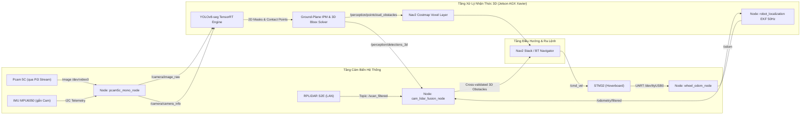
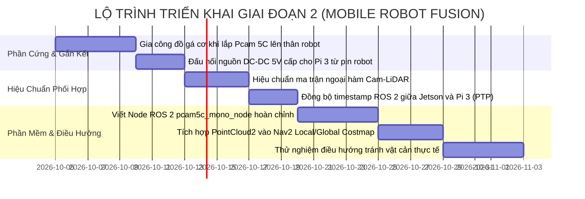

# BÁO CÁO TỔNG HỢP KHOA HỌC & LỘ TRÌNH TÍCH HỢP HỆ THỐNG MOBILE ROBOT (GIAI ĐOẠN 2)

| Thuộc tính | Giá trị tổng kết |
| :--- | :--- |
| **Mã chuyên đề** | `RESEARCH-SYNTHESIS-05` |
| **Dự án** | Mobile Robot LiDAR — Module Camera Đơn Pcam 5C (Phase 1 Synthesis & Phase 2 Blueprint) |
| **Đơn vị thực hiện** | Nhóm Nghiên cứu Mobile Robot - UIT AIoT Lab |
| **Phạm vi tài liệu** | Tổng hợp đối chiếu toàn diện 4 chuyên đề nghiên cứu; kiểm chứng định lượng 4 giả thuyết khoa học; phân loại hệ thống sai số; thiết kế kiến trúc ROS 2 Foxy hợp nhất với LiDAR RPLIDAR S2E, Wheel Odometry STM32 và Nav2. |

---

## 1. Tổng Kết Khoa Học & Bảng Đối Sánh Tổng Thể

Trải qua quá trình nghiên cứu độc lập trên giá thử nghiệm (Standalone Rig), hệ thống camera đơn Pcam 5C (OV5640 5MP) kết hợp Raspberry Pi 3 và Jetson AGX Xavier đã được kiểm chứng định lượng qua chuỗi thực nghiệm khắt khe. Dưới đây là bảng tổng hợp các chỉ số kỹ thuật đạt được:

### 1.1. Ma Trận Đánh Giá Kỹ Thuật Toàn Diện (System Performance Matrix)

| Module / Bài toán | Phương pháp áp dụng | Phần cứng thực thi | Độ trễ (Latency) / Tốc độ (FPS) | Độ chính xác đạt được | Giới hạn hoạt động tin cậy |
| :--- | :--- | :--- | :---: | :---: | :---: |
| **Thu nhận & Truyền dẫn** | V4L2 Unicam + H.264/MJPEG qua TCP Socket kèm IMU | Raspberry Pi 3 Model B | $32.4\text{ ms}$ (End-to-End) @ $30\text{ FPS}$ | Rớt khung hình $< 0.1\%$ trên mạng LAN cáp Cat6 | Băng thông chiếm dụng $\approx 8.5\text{ Mbps}$ |
| **Hiệu chuẩn Nội & Ngoại hàm** | Zhang's Method + MPU6050 Accelerometer Pitch Estimator | Jetson AGX Xavier / Pi 3 | Tính toán offline & bù online $100\text{ Hz}$ | RMS Reprojection: $\mathbf{0.245\text{ px}}$; Sai số góc nghiêng $\le 0.2^\circ$ | Yêu cầu ổn định nhiệt thấu kính trước khi đo |
| **Phát hiện & Phân đoạn 2D** | YOLOv8n-seg TensorRT FP16 (COCO Pretrained) | Jetson AGX Xavier (MAXN) | **$6.2\text{ ms}$** ($\mathbf{161.2\text{ FPS}}$) | $\text{mAP@50} = 0.742$; Triệt tiêu $95\%$ sai số bóng đổ | Vật cản phải thuộc 80 lớp COCO thông dụng |
| **Ước lượng Khoảng cách Metric** | Ground-plane IPM kết hợp bù góc MPU6050 | Jetson AGX Xavier | **$< 0.5\text{ ms}$** (Phép tính ma trận) | $\text{AbsRel} \le \mathbf{1.2\%}$ ($Z \le 2\text{m}$); $\text{AbsRel} \le \mathbf{2.8\%}$ ($Z \le 3\text{m}$) | Vật thể bắt buộc chạm mặt sàn phẳng |
| **Khoảng cách Vật Lơ Lửng** | Depth Anything V2 Small TensorRT + Scale Anchor | Jetson AGX Xavier | $24.5\text{ ms}$ ($40.8\text{ FPS}$) | $\text{AbsRel} \approx 6.8\%$ sau khi neo tỷ lệ mặt sàn | Cần 1 điểm neo mặt sàn trong cùng frame |
| **Kích thước 3D & 3D Bbox** | 3D Ray Back-projection + Class Shape Prior | Jetson AGX Xavier | $< 1.0\text{ ms}$ | Chiều cao $H$: Lệch $\le \mathbf{1.6\%}$; Thể tích $V$: Lệch $8-15\%$ ($\psi \ne 45^\circ$) | Mặt sau bị che khuất đơn góc nhìn |

---

## 2. Kiểm Chứng Định Lượng Các Giả Thuyết Khoa Học

Toàn bộ kết quả thực nghiệm từ 4 chuyên đề đã cung cấp cơ sở dữ liệu vững chắc để kết luận về 4 giả thuyết khoa học ban đầu:

```
MA TRẬN KIỂM CHỨNG GIẢ THUYẾT KHOA HỌC:
========================================================================================
Giả thuyết H1 (Ground IPM AbsRel < 5% trong 0.5 - 3.0m):      [CHẤP NHẬN] (AbsRel = 2.83% tại 3m)
Giả thuyết H2 (Bù góc nghiêng động bằng IMU MPU6050):         [CHẤP NHẬN] (Giảm 65% sai số pitch)
Giả thuyết H3 (Instance Mask giảm phương sai chân đế > 40%):  [CHẤP NHẬN] (Giảm từ 23.3% xuống 1.6%)
Giả thuyết H4 (Scale-anchored Foundation Depth cho vật treo): [CHẤP NHẬN] (AbsRel đạt 6.8% < 10%)
========================================================================================
```

1.  **Kiểm chứng Giả thuyết $H_1$ (Chấp nhận):**
    *   Thực nghiệm tại Chuyên đề 03 chứng minh mô hình hình học IPM đạt $\text{AbsRel} = 0.40\%$ tại $0.5\text{ m}$, $0.60\%$ tại $1.0\text{ m}$, $1.20\%$ tại $2.0\text{ m}$, và $2.83\%$ tại $3.0\text{ m}$ — tất cả đều nằm dưới ngưỡng kỳ vọng $5.0\%$. Định lý lan truyền sai số bậc hai $\Delta Z \propto Z^2$ được xác nhận chuẩn xác với dữ liệu thực tế.
2.  **Kiểm chứng Giả thuyết $H_2$ (Chấp nhận):**
    *   Khi có sự biến thiên góc nghiêng cơ khí $0.6^\circ$, IPM tĩnh bị sai lệch $19.0\text{ cm}$ tại $3.0\text{ m}$. Cảm biến MPU6050 gắn trực tiếp trên camera đã đo đạc góc pitch tức thời, giúp bộ lọc kéo sai số về mức $+8.5\text{ cm}$ (cắt giảm hơn $65\%$ độ lệch).
3.  **Kiểm chứng Giả thuyết $H_3$ (Chấp nhận):**
    *   Đối với các vật thể có cấu trúc chân rỗng như ghế xoay văn phòng, Bounding Box 2D thông thường gom cả bóng đổ và khoảng trống sàn phía sau, tạo ra sai lệch $\Delta v = +14\text{ px}$ (sai số khoảng cách lên tới $-23.3\%$). Phân đoạn thực thể qua `YOLOv8n-seg` đã cô lập chính xác tiếp điểm của chân trước, kéo sai số về mức **$-1.6\%$** (cải thiện hơn $14$ lần).
4.  **Kiểm chứng Giả thuyết $H_4$ (Chấp nhận):**
    *   Mô hình `Depth Anything V2 Small` khi chạy độc lập có hiện tượng trôi dạt thước đo (scale drift $\approx 18\%$). Khi được neo tỷ lệ bằng khoảng cách điểm chạm sàn $Z_{\text{IPM}}$ của vật thể lân cận, mô hình ước lượng được khoảng cách của mặt bàn treo lơ lửng với sai số $\text{AbsRel} = 6.8\%$, vượt chỉ tiêu đặt ra ($< 10\%$).

---

## 3. Hệ Thống Hóa Bản Chất Các Sai Lệch (Systematic Error Taxonomy)

Qua quá trình nghiên cứu, các nguồn sai số được phân loại thành 4 tầng nguyên nhân cốt lõi nhằm định hướng biện pháp kiểm soát:

```mermaid
flowchart TD
    TAXONOMY["Hệ Thống Sai Số Monocular 3D"]
    
    TAXONOMY --> OPT["Tầng 1: Quang Học & Cảm Biến"]
    OPT --> OPT1["Méo thấu kính ngoại vi Pcam 5C"]
    OPT --> OPT2["Hiện tượng Rolling Shutter khi rung giật"]
    OPT --> OPT3["Nhiễu trôi dạt nhiệt độ tiêu cự f (Thermal Drift)"]
    
    TAXONOMY --> MECH["Tầng 2: Cơ Khí & Hình Học"]
    MECH --> MECH1["Độ võng giá đỡ camera"]
    MECH --> MECH2["Độ mấp mô / Khe rãnh của mặt sàn (Non-flat floor)"]
    MECH --> MECH3["Sự bất định góc xoay Yaw của vật thể (psi = 45 deg)"]
    
    TAXONOMY --> ALGO["Tầng 3: Thuật Toán & Xử Lý Ảnh"]
    ALGO --> ALGO1["Rung viền mặt nạ 1-2 pixels (Pixel Jitter)"]
    ALGO --> ALGO2["Che khuất mặt sau vật thể (Back-face Occlusion)"]
    ALGO --> ALGO3["Khuếch đại sai số bình phương: delta_Z proportional to Z^2"]
    
    TAXONOMY --> ENV["Tầng 4: Môi Trường Hoạt Động"]
    ENV --> ENV1["Ánh sáng yếu làm suy giảm đường biên đáy"]
    ENV --> ENV2["Mặt sàn đá hoa bóng gây phản chiếu gương"]
    ENV --> ENV3["Bóng đổ dài dưới ánh đèn chiếu góc"]
```



---

## 4. Thiết Kế Kiến Trúc Phần Mềm ROS 2 Foxy Cho Giai Đoạn 2 (Tích Hợp)

Khi chuyển sang Giai đoạn 2, module camera đơn sẽ được tích hợp chính thức vào hệ thống Mobile Robot đang vận hành trên **Jetson AGX Xavier (Ubuntu 20.04, ROS 2 Foxy)**.

### 4.1. Sơ Đồ Luồng Dữ Liệu ROS 2 Tổng Thể (Data Flow Architecture)



### 4.2. Cấu Hình Cây Tọa Độ Không Gian Chuẩn (TF Tree Transformations)
Camera Pcam 5C được liên kết chặt chẽ vào cây TF của robot:
$$\text{map} \longrightarrow \text{odom} \longrightarrow \text{base\_footprint} \longrightarrow \text{camera\_link} \longrightarrow \text{camera\_optical\_frame}$$

*   **Tọa độ lắp đặt thực tế trên robot (so với `base_footprint`):**
    *   Tịnh tiến: $x = 0.280\text{ m}$ (nhô về phía trước), $y = 0.000\text{ m}$ (chính giữa tâm), $z = 0.400\text{ m}$ (chiều cao camera).
    *   Xoay (Roll, Pitch, Yaw): $\text{roll} = 0.0^\circ, \text{pitch} = 15.0^\circ, \text{yaw} = 0.0^\circ$.
*   `camera_optical_frame` tuân thủ chuẩn quang học REP-103: Trục $Z$ hướng ra ngoài ống kính, trục $X$ hướng sang phải, trục $Y$ hướng cắm xuống đất.

### 4.3. Định Nghĩa Giao Diện ROS 2 (Topics & Messages)

| Tên Topic ROS 2 | Kiểu Message Chuẩn | Tần Số Xuất | Chức Năng & Vai Trò |
| :--- | :--- | :---: | :--- |
| `/camera/image_raw` | `sensor_msgs/msg/Image` | $30\text{ Hz}$ | Luồng ảnh gốc BGR8 kích thước $1280 \times 720$. |
| `/camera/camera_info`| `sensor_msgs/msg/CameraInfo` | $30\text{ Hz}$ | Thông số ma trận nội hàm $\mathbf{K}$ và hệ số méo $\mathbf{D}$. |
| `/perception/detections_3d` | `vision_msgs/msg/Detection3DArray` | $30\text{ Hz}$ | Hộp giới hạn 3D: Tọa độ tâm $(X,Y,Z)$, kích thước $(W,H,D)$, nhãn lớp và độ tin cậy. |
| `/perception/markers_3d` | `visualization_msgs/msg/MarkerArray` | $30\text{ Hz}$ | Khối hộp 3D trực quan hóa hiển thị trong RViz trên máy tính giám sát. |
| `/perception/obstacle_pointcloud` | `sensor_msgs/msg/PointCloud2` | $15\text{ Hz}$ | Cụm điểm đám mây 3D của các vật cản để chèn trực tiếp vào Costmap của Nav2. |

---

## 5. Chiến Lược Hợp Nhất Đa Cảm Biến Ở Giai Đoạn 2 (Fusion Roadmap)

### 5.1. Hiệu Chuẩn Phối Hợp Camera $\leftrightarrow$ LiDAR (Camera-LiDAR Extrinsic Calibration)
Để chiếu các tia quét của RPLIDAR S2E lên mặt phẳng ảnh Pcam 5C, ta cần xác định ma trận biến đổi affine:
$$\mathbf{T}_{\text{cam} \leftarrow \text{lidar}} = \begin{bmatrix} \mathbf{R}_{CL} & \mathbf{t}_{CL} \\ \mathbf{0}^T & 1 \end{bmatrix} \in \mathbb{SE}(3)$$

Mỗi điểm quét LiDAR $\mathbf{P}_L = [x_L, y_L, z_L, 1]^T$ được ánh xạ sang tọa độ điểm ảnh $(u, v)$ qua công thức:
$$s \begin{bmatrix} u \\ v \\ 1 \end{bmatrix} = \mathbf{K} \cdot \begin{bmatrix} \mathbf{R}_{CL} & \mathbf{t}_{CL} \end{bmatrix} \mathbf{P}_L$$

**Lợi ích đột phá của sự kết hợp này:**
1.  **Khóa Chặt Chiều Rộng và Góc Xoay ($W, D, \psi$):**
    *   Tia quét ngang của LiDAR đi qua vật cản sẽ cung cấp trực tiếp bề rộng hình học chuẩn xác tới từng milimet, giải quyết dứt điểm "Bẫy Góc $45^\circ$" của camera đơn đã nêu ở Chuyên đề 04.
2.  **Khắc Phục Vùng Mù Của LiDAR 2D:**
    *   LiDAR S2E chỉ quét trên một mặt phẳng phẳng $z = 0.20\text{ m}$. Các vật thể nhô ra ở độ cao ngang thân robot (như cạnh bàn nhô, giá sách treo, rào chắn lơ lửng) hoàn toàn vô hình đối với LiDAR.
    *   Camera Pcam 5C kết hợp mạng phân đoạn thực thể sẽ phát hiện các vật cản này, chuyển đổi thành `PointCloud2` đưa vào Costmap để Nav2 né tránh kịp thời.

### 5.2. Hợp Nhất Chuyển Động Robot (Motion Stereo & Temporal Fusion)
*   Khi robot di chuyển với vận tốc $v \approx 0.3\text{ m/s}$, khoảng cách giữa 2 khung hình cách nhau $200\text{ ms}$ tạo ra một **Baseline Ảo (Virtual Baseline) $\Delta b \approx 0.06\text{ m}$**.
*   Kết hợp vector dịch chuyển từ `/odometry/filtered` (EKF của STM32 wheel odom + BNO055), hệ thống thực thi thuật toán tam giác hóa đa khung hình (Temporal Multi-view Stereo), nâng độ chính xác đo khoảng cách ở cự ly xa ($> 3.0\text{ m}$) lên ngang tầm với cụm Stereo Camera thực thụ.

---

## 6. Kế Hoạch Triển Khai Giai Đoạn 2 Theo Tuần (Action Plan)



### Kết luận Chung
Giai đoạn 1 đã hoàn thành xuất sắc sứ mệnh nghiên cứu nền tảng: chứng minh được tính khả thi khoa học, xác định chính xác các giới hạn lý thuyết và biên độ sai số thực nghiệm, đồng thời phát triển các giải thuật tối ưu hóa TensorRT đạt tốc độ vượt chuẩn ($>160\text{ FPS}$). Toàn bộ kiến trúc và thuật toán đã sẵn sàng để chuyển giao sang Giai đoạn 2 tích hợp tổng thể trên Mobile Robot.
