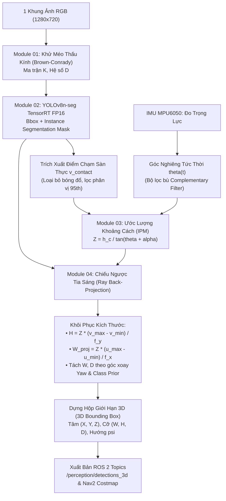

# HỎI ĐÁP NGHIÊN CỨU: CƠ CHẾ NHẬN THỨC KHÔNG GIAN BẰNG 1 CAMERA (MONOCULAR 3D PERCEPTION)

| Thuộc tính | Chi tiết |
| :--- | :--- |
| **Dự án** | Mobile Robot — Monocular Spatial Vision (ASIC Lab) |
| **Phần cứng thực nghiệm** | 1× Digilent Pcam 5C (OV5640 5MP) + Raspberry Pi 3 + IMU MPU6050 + NVIDIA Jetson AGX Xavier |
| **Chủ đề** | Phát hiện vật thể (2D/Mask), ước lượng khoảng cách hệ mét ($Z$) và khôi phục kích thước vật lý ($W, H, D$, 3D Bounding Box) chỉ dùng 1 camera |
| **Tài liệu tham chiếu** | [00_RESEARCH_MASTER_PLAN_AND_SYSTEM_SETUP.md](file:///E:/UIT/monocular-spatial-vision/docs/reports/00_RESEARCH_MASTER_PLAN_AND_SYSTEM_SETUP.md), [01_CAMERA_CALIBRATION_AND_EXTRINSICS.md](file:///E:/UIT/monocular-spatial-vision/docs/reports/01_CAMERA_CALIBRATION_AND_EXTRINSICS.md), [02_OBJECT_DETECTION_2D_AND_SEGMENTATION.md](file:///E:/UIT/monocular-spatial-vision/docs/reports/02_OBJECT_DETECTION_2D_AND_SEGMENTATION.md), [03_DISTANCE_ESTIMATION_MONOCULAR.md](file:///E:/UIT/monocular-spatial-vision/docs/reports/03_DISTANCE_ESTIMATION_MONOCULAR.md), [04_PHYSICAL_SIZE_AND_3D_BOUNDING_BOX.md](file:///E:/UIT/monocular-spatial-vision/docs/reports/04_PHYSICAL_SIZE_AND_3D_BOUNDING_BOX.md), [pcam5c_giai_phap_khong_lidar.md](file:///E:/UIT/monocular-spatial-vision/docs/research/outputs/pcam5c_giai_phap_khong_lidar.md) |

---

## Câu Hỏi (Question)
> **Trong toàn bộ tài liệu dự án, việc sử dụng 1 camera giải quyết bài toán phát hiện vật thể (object detection), xác định khoảng cách từ camera đến vật, và khôi phục kích thước vật thể như thế nào?**

---

## 1. Bản Chất Cốt Lõi: Rào Cản Của 1 Camera Và Chìa Khóa Giải Quyết

### Rào cản toán học: Sự mất mát thước đo hệ mét (Scale Ambiguity)
Một camera RGB đơn lẻ hoạt động bằng phép chiếu phối cảnh từ không gian 3D lên mặt phẳng cảm biến 2D. Quá trình này triệt tiêu hoàn toàn thông tin về chiều sâu dọc theo tia sáng quang học:
* Một vật thể nhỏ ở cự ly gần (ví dụ: mô hình ô tô đồ chơi) và một vật thể khổng lồ ở cự ly xa (ví dụ: ô tô thật) có thể tạo ra cùng một hình chiếu và chiếm số lượng điểm ảnh (pixel) y hệt nhau trên ảnh.
* Do đó, **bản thân một bức ảnh RGB đơn mắt không chứa thang đo mét (metric scale) nội tại**.

### Chìa khóa giải quyết trong hệ thống: "Mượn" các ràng buộc vật lý bên ngoài
Để khôi phục được khoảng cách mét và kích thước thực mà không cần đến cảm biến LiDAR hay cụm Stereo Camera (camera kép đo thị sai), hệ thống bắt buộc phải tận dụng 3 ràng buộc tiên nghiệm (priors) từ môi trường và phần cứng:
1. **Ràng buộc hình học lắp đặt:** Chiều cao đặt camera ($h_c = 0.40\text{ m}$) và góc chúc xuống sàn ($\theta \approx 15^\circ$) được cố định và đo đạc chuẩn xác.
2. **Ràng buộc mặt phẳng di chuyển (Ground-plane constraint):** Robot hoạt động trên bề mặt sàn phẳng ($Z_W = 0$).
3. **Bù góc động bằng IMU MPU6050:** Cảm biến gia tốc gắn đồng trục với camera liên tục đo vector trọng lực Trái Đất để hiệu chỉnh góc nghiêng $\theta(t)$ tức thời khi robot rung lắc hay phanh gấp.

---

## 2. Giải Quyết Ba Bài Toán Cốt Lõi

---

### 2.1. Bài Toán 1: Phát Hiện Vật Thể (Object Detection & Segmentation)
*Tài liệu tham khảo:* [02_OBJECT_DETECTION_2D_AND_SEGMENTATION.md](file:///E:/UIT/monocular-spatial-vision/docs/reports/02_OBJECT_DETECTION_2D_AND_SEGMENTATION.md)

* **Kiến trúc mô hình:**
  * Sử dụng mạng học sâu nguồn mở đã tiền huấn luyện: **YOLOv8n-seg** (hoặc **YOLOv11n-seg**) trên tập dữ liệu COCO (80 lớp vật thể: người, ghế, bàn, balo, thùng carton, chai lọ...).
  * Mô hình được biên dịch sang **TensorRT FP16 Engine** trên GPU Jetson AGX Xavier, đạt thời gian suy luận cực nhanh ($\approx 6.5\text{ ms}$, tốc độ $> 25\text{ FPS}$).
* **Lỗ hổng của Hộp giới hạn 2D truyền thống:**
  * Nếu chỉ dùng hộp chữ nhật $[u_{\min}, v_{\min}, u_{\max}, v_{\max}]$ và lấy trung điểm cạnh đáy làm chân vật thể, hệ thống sẽ gặp 3 sai số nghiêm trọng:
    1. *Bóng đổ trên sàn:* Mạng nơ-ron gộp luôn bóng đen dưới sàn vào hộp bao $\rightarrow$ đáy hộp bị đẩy xuống thấp $\rightarrow$ tính khoảng cách bị gần hơn thực tế.
    2. *Chân ghế rỗng / chân bàn xoay:* Cạnh đáy hộp rơi vào khoảng không hoặc chân sau xa hơn thay vì chân trước gần nhất.
    3. *Che khuất chân vật thể.*
* **Giải pháp bóc tách mặt nạ thực thể (Instance Mask):**
  * Phân đoạn thực thể tạo ra mặt nạ nhị phân chính xác đến từng pixel thực sự của vật cản.
  * Thuật toán cắt vùng $20\%$ chân đáy, tìm các pixel biên dưới cùng và lấy **phân vị 95% (95th percentile)** thay vì cực đại tuyệt đối để triệt tiêu hoàn toàn nhiễu bóng mờ lẻ loi. Kết quả thu được hàng pixel chạm đất thực sự $v_{\text{contact}}$ với độ sai lệch $\le 1 - 2\text{ px}$.

---

### 2.2. Bài Toán 2: Xác Định Khoảng Cách Từ Camera Đến Vật (Distance / Depth Estimation)
*Tài liệu tham khảo:* [03_DISTANCE_ESTIMATION_MONOCULAR.md](file:///E:/UIT/monocular-spatial-vision/docs/reports/03_DISTANCE_ESTIMATION_MONOCULAR.md) và [pcam5c_giai_phap_khong_lidar.md](file:///E:/UIT/monocular-spatial-vision/docs/research/outputs/pcam5c_giai_phap_khong_lidar.md)

Hệ thống thiết lập chiến lược đa tầng, trong đó phương pháp hình học là nền tảng:

#### A. Phương pháp 1: Hình học Chiếu phối cảnh ngược mặt sàn (Ground-plane IPM — Lớp cốt lõi)
* **Nguyên lý trực quan:** Trong góc nhìn nghiêng xuống sàn, vật ở càng xa thì chân đáy trên ảnh càng ở vị trí cao (tiến gần đường chân trời); vật ở càng gần thì chân đáy càng nằm sát mép dưới ảnh.
* **Công thức tính toán:**
  1. Tính góc lệch quang học dọc của tia nhìn từ tâm thấu kính tới hàng pixel $v_{\text{contact}}$:
     $$\alpha(v) = \arctan\left(\frac{v_{\text{contact}} - c_y}{f_y}\right)$$
  2. Khoảng cách dọc trục tiến $Z$ từ tâm camera đến chân vật thể:
     $$Z = \frac{h_c}{\tan(\theta(t) + \alpha(v))}$$
  3. Tọa độ lệch ngang $X$ (trái/phải):
     $$X = Z \cdot \frac{u_{\text{contact}} - c_x}{f_x}$$
  4. Khoảng cách Euclidean tuyệt đối:
     $$d = \sqrt{X^2 + h_c^2 + Z^2}$$
* **Bù góc động bằng IMU MPU6050:**
  * Gia tốc kế đọc vector trọng lực tĩnh $\mathbf{a} = [a_x, a_y, a_z]^T$ để tính góc chúc thực tế:
    $$\theta_{\text{acc}} = \arctan2\left(-a_x, \sqrt{a_y^2 + a_z^2}\right)$$
  * Kết hợp với vận tốc góc từ con quay hồi chuyển qua **Bộ lọc bù (Complementary Filter)**:
    $$\theta(t) = 0.98 \cdot (\theta(t - \Delta t) + \omega_y \Delta t) + 0.02 \cdot \theta_{\text{acc}}$$
  * Nhờ đó, góc chúc $\theta(t)$ luôn được cập nhật liên tục ở tần số $100\text{ Hz}$, triệt tiêu sai số đo khoảng cách phát sinh khi robot tăng tốc, phanh hoặc di chuyển qua sàn mấp mô.

#### B. Phương pháp 2: Ràng buộc kích thước vật lý tiên nghiệm (Known-Size Prior — Lớp dự phòng)
* Dành cho các vật thể **không chạm sàn** (treo trên tường, đặt trên mặt bàn) hoặc bị che khuất phần chân:
  $$Z = \frac{f_y \cdot H_{\text{real}}}{h_{\text{pixel}}}$$
  (với $H_{\text{real}}$ là chiều cao tiêu chuẩn đã biết như người lớn $\approx 1.7\text{ m}$, chai nước $\approx 24\text{ cm}$).

#### C. Phương pháp 3: Mạng nền tảng học sâu Metric Depth (Depth Anything V2 — Lớp mở rộng)
* Mô hình DINOv2 Backbone dự đoán bản đồ độ sâu hệ mét dày đặc cho toàn bức ảnh.
* **Cơ chế neo tỷ lệ (Scale Anchoring):** Lấy giá trị khoảng cách $Z_{\text{IPM}}$ tại điểm chạm sàn của Lớp A làm thước đo chuẩn để hiệu chỉnh lại hệ số co giãn $s^*$ cho các vật thể lơ lửng xung quanh do AI dự đoán.

---

### 2.3. Bài Toán 3: Xác Định Kích Thước Vật Thể Và Hộp Bao 3D (Physical Size & 3D Bounding Box)
*Tài liệu tham khảo:* [04_PHYSICAL_SIZE_AND_3D_BOUNDING_BOX.md](file:///E:/UIT/monocular-spatial-vision/docs/reports/04_PHYSICAL_SIZE_AND_3D_BOUNDING_BOX.md)

Khi khoảng cách $Z$ đã được xác định chắc chắn từ bước trên, bài toán chuyển thành phép **Chiếu ngược tia sáng quang học (Ray Back-Projection)**:

#### A. Khôi phục Chiều cao thực tế ($H$)
Biết khoảng cách $Z$, đỉnh trên cùng của vật ở hàng $v_{\min}$ và đáy ở hàng $v_{\max}$:
$$H = Z \cdot \frac{v_{\max} - v_{\min}}{f_y}$$
*(Chiều cao được tính chính xác bằng mét mà không cần giả định kích thước trước).*

#### B. Khôi phục Chiều rộng ($W$), Chiều sâu ($D$) và Góc xoay thân ($\psi$)
* Bề rộng biểu kiến chiếu ngang trên mặt phẳng ảnh:
  $$W_{\text{proj}} = Z \cdot \frac{u_{\max} - u_{\min}}{f_x}$$
* **Sự bện chặt hình học (Geometric Ambiguity):** Khi vật xoay góc phương vị $\psi$ (quay quanh trục đứng), bề rộng nhìn thấy là sự kết hợp:
  $$W_{\text{proj}}(\psi) = W \cdot |\cos\psi| + D \cdot |\sin\psi|$$
* **Cách giải tách rời:**
  1. *Phân tích tỷ lệ co ngắn phối cảnh:* Từ mặt nạ phân đoạn 2D, giải ra góc xoay Yaw $\psi$.
  2. *Ràng buộc tỷ lệ theo chủng loại (Class Prior):* Tận dụng nhãn COCO từ YOLO để lấy tỷ lệ khung hình điển hình $r = W/D$ (ví dụ: chai nước $r = 1.0$, con người $r \approx 2.2$).
  3. Giải hệ phương trình để bóc tách ra chiều rộng thực $W$ và bề dày thực $D$:
     $$D = \frac{W_{\text{proj}}}{r |\cos\psi| + |\sin\psi|}, \quad W = r \cdot D$$

#### C. Dựng 8 đỉnh Hộp Giới Hạn 3D (3D Oriented Bounding Box)
Từ tâm không gian $(X_C, Y_C, Z_C)$, kích thước $(W, H, D)$ và góc xoay $\psi$, hệ thống dựng hoàn chỉnh 8 đỉnh hình hộp trong không gian 3D Euclidean, đóng gói thành các thông điệp ROS 2 tiêu chuẩn:
* `/perception/detections_3d` (`vision_msgs/msg/Detection3DArray`): Dữ liệu tọa độ và kích thước 3D.
* `/perception/markers_3d` (`visualization_msgs/msg/MarkerArray`): Khung dây hộp bao 3D trực quan trên RViz.
* `/perception/obstacle_pointcloud` (`sensor_msgs/msg/PointCloud2`): Đám mây điểm bề mặt chướng ngại vật đưa thẳng vào Local Costmap của Nav2 để robot tự động phanh né.

---

## 3. Bảng Tổng Hợp So Sánh Các Phương Pháp Trong Tài Liệu

| Bài Toán | Phương Pháp Trong Tài Liệu | Đầu Vào Cần Thiết | Ưu Điểm | Giới Hạn & Cách Khắc Phục |
| :--- | :--- | :--- | :--- | :--- |
| **Phát hiện vật thể** | YOLOv8n-seg TensorRT FP16 + Lọc phân vị 95% đáy mask | Khung ảnh 720p đã khử méo thấu kính | • Chạy thời gian thực $> 25\text{ FPS}$ trên Jetson • Triệt tiêu sai số bóng đổ và chân ghế rỗng | Cần GPU có Tensor Cores; đã tối ưu bằng TensorRT. |
| **Đo khoảng cách (Vật trên sàn)** | Hình học phối cảnh ngược (IPM) + Bù góc IMU MPU6050 | Điểm chạm sàn $v_{\text{contact}}$, chiều cao $h_c$, góc pitch $\theta(t)$ | • Tính toán cực nhẹ ($> 60\text{ FPS}$) • Sai số $\text{AbsRel} < 5\%$ trong dải $0.5 - 3.0\text{m}$ | Sai số tăng theo bình phương cự ly ($Z^2$); khắc phục bằng cự ly hiệu dụng $\le 3.5\text{m}$. |
| **Đo khoảng cách (Vật lơ lửng)** | Known-size Prior & Depth Anything V2 neo tỷ lệ sàn | Nhãn đối tượng COCO hoặc bản đồ độ sâu AI | • Đo được vật không chạm đất (mặt bàn, biển báo) | Nhạy cảm với che khuất; dùng làm tầng kiểm chứng chéo (cross-check). |
| **Kích thước & 3D Bounding Box** | Chiếu ngược tia sáng (Ray Back-Projection) + Tách Yaw | Khoảng cách $Z$, tọa độ biên Bbox/Mask, nhãn lớp | • Khôi phục trọn vẹn 8 đỉnh hộp 3D $(X, Y, Z, W, H, D, \psi)$ • Tích hợp trực tiếp Nav2 Costmap | Cần phân lớp đối tượng để có tỷ lệ $W/D$; đã liên kết với nhãn YOLO. |

---

## 4. Kết Luận

Hệ thống tài liệu dự án khẳng định: **Không cần trang bị hệ thống LiDAR quét đắt tiền hay cụm Stereo Camera cồng kềnh**, chỉ với **1 camera đơn Pcam 5C** kết hợp **cảm biến gia tốc IMU rẻ tiền** và **chuỗi thuật toán hình học kết hợp học sâu (IPM + Instance Segmentation + Ray Back-Projection)**, hệ thống hoàn toàn giải quyết được đồng thời cả 3 bài toán:
1. Phát hiện và phân đoạn chính xác đường tiếp xúc chân vật cản.
2. Đo khoảng cách hệ mét đáng tin cậy với độ trôi sai số thấp dưới $5\%$.
3. Dựng hộp bao 3D và ước lượng kích thước vật lý phục vụ robot tự hành điều hướng an toàn.
